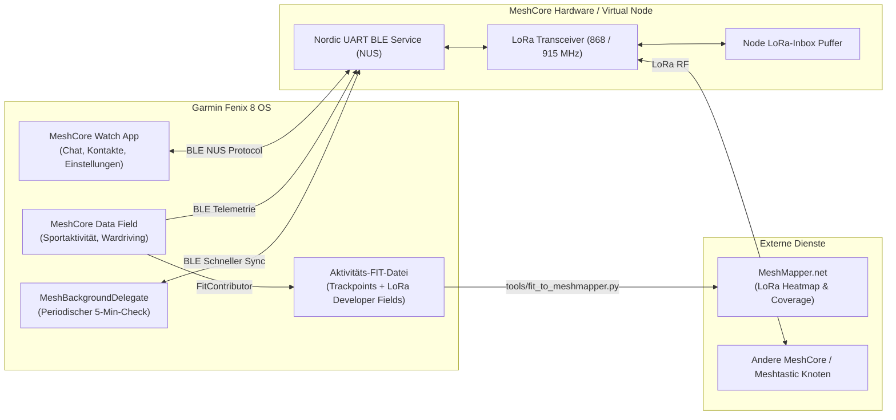
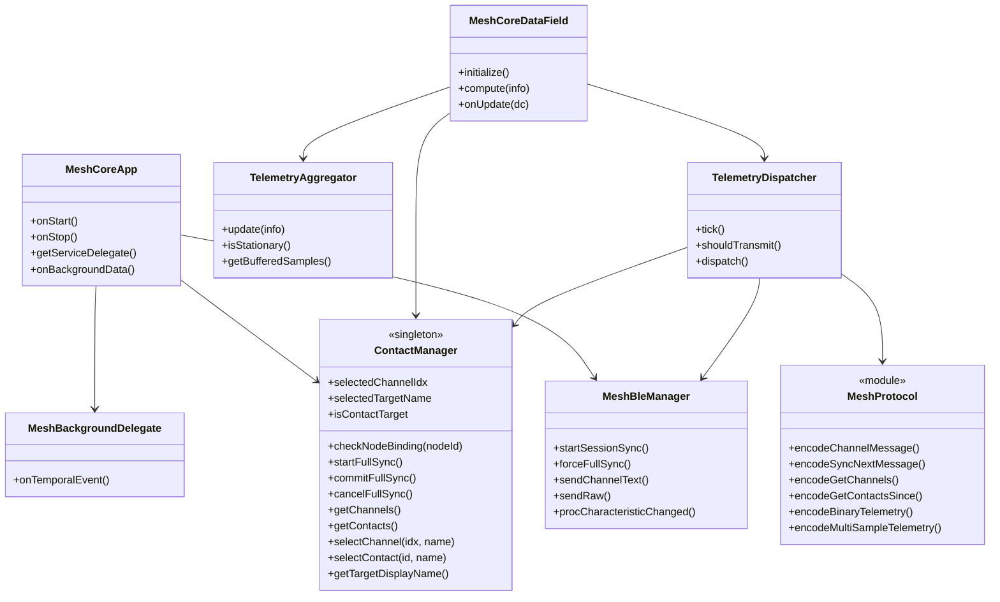
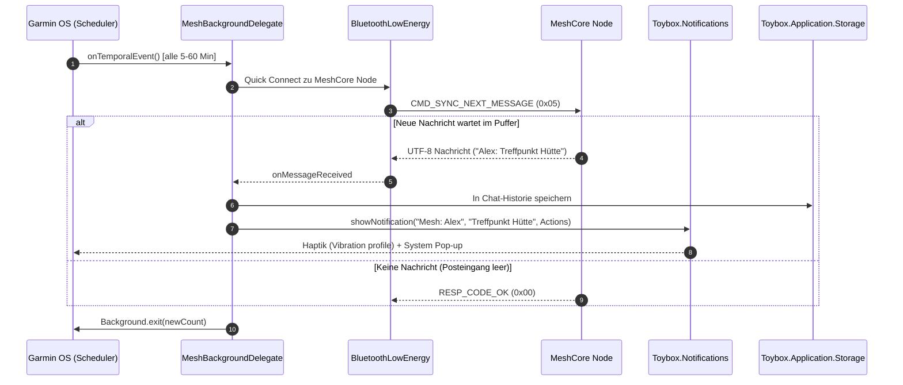
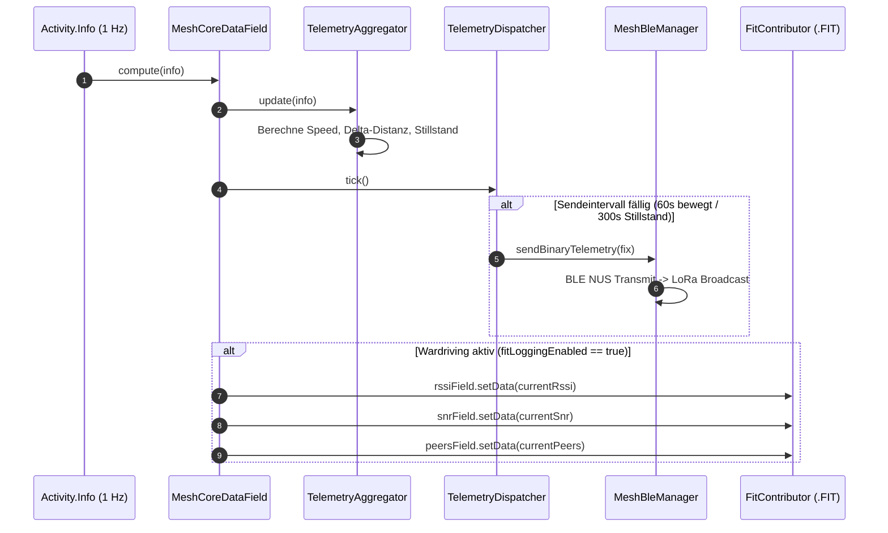
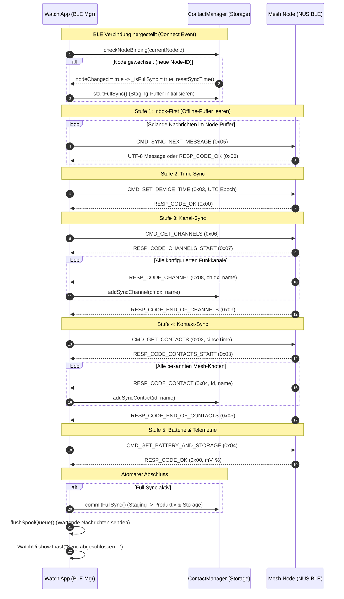
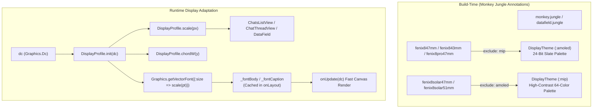

# arc42 Architektur-Dokumentation: Garmin MeshCore & MeshMapper

## 1. Einführung und Ziele

Das Projekt **Garmin MeshCore** verbindet Garmin Smartwatches (speziell Fenix 8 Serie mit Connect IQ System 8 / API Level 5.1.0) über Bluetooth Low Energy (BLE) mit autonomen LoRa-Mesh-Funkknoten (MeshCore / Meshtastic). Es ermöglicht autarke Off-Grid-Kommunikation, Notruf-Alarmierung, zyklische Telemetrie-Aussendung und LoRa-Netzabdeckungs-Kartierung (Wardriving via MeshMapper).

### 1.1 Wesentliche Qualitätsziele

| Priorität | Qualitätsziel | Motivation & Begründung |
|---|---|---|
| **1** | **Zuverlässigkeit & Ausfallsicherheit (Fail-Fast)** | Bei echten Verbindungsabbrüchen darf niemals mit scheinbar intakten Cache- oder Fake-Daten gearbeitet werden. Fehlerzustände müssen sofort gemeldet werden. |
| **2** | **Airtime- & Energie-Effizienz** | LoRa-Frequenzen unterliegen gesetzlichen Duty-Cycle-Beschränkungen (1 % in EU868). Telemetriedaten müssen ultra-kompakt übertragen und bei Stillstand gedrosselt werden. |
| **3** | **Zero-Wait UI Responsiveness** | Die Benutzeroberfläche auf der Uhr darf unter keinen Umständen durch BLE-Transfers oder Speicherzugriffe blockieren (60 FPS AMOLED Experience). |
| **4** | **Nahtlose Fitness- & MeshMapper-Integration** | LoRa-Signalstärken (RSSI, SNR) und Mesh-Metriken müssen synchron mit dem GPS-Track in die Aktivitäts-FIT-Datei geschrieben werden. |

### 1.2 Stakeholder

| Rolle | Erwartungshaltung |
|---|---|
| **Outdoor-Sportler / Wanderer** | Zuverlässige Notruffunktion, Standortübermittlung ohne Mobilfunk, Verfolgung von Teammitgliedern. |
| **Mesh-Community / Mapper** | Wardriving-Daten zur Vermessung der regionalen LoRa-Netzabdeckung (Upload zu MeshMapper.net). |
| **Entwickler & Tester** | Vollwertige Virtual-Node-Simulation direkt im Connect IQ Simulator ohne zwingende physische Funkhardware. |

---

## 2. Randbedingungen und Beschränkungen

* **Garmin Connect IQ App-Typen:** Ein Programm kann entweder `watch-app` oder `data-field` sein. Eine Kombination in einer einzigen PRG-Datei ist vom Betriebssystem nicht erlaubt $\rightarrow$ Dual-Target-Architektur (`monkey.jungle` und `datafield.jungle`).
* **Hintergrund-Ausführung (`Toybox.Background`):**
  * Mindestintervall für temporale Hintergrund-Ereignisse: **300 Sekunden (5 Minuten)**.
  * Maximale Laufzeit pro Hintergrundaufruf: **30 Sekunden**.
  * Speicherbeschränkung Hintergrundprozess: 32 KB bis 64 KB.
* **LoRa-Funkbandbreite:** Maximale Payload pro LoRa-Paket ca. 200–240 Bytes, Spreading Factor SF7 bis SF12.

---

## 3. Kontextabgrenzung



---

## 4. Lösungsstrategie

1. **Duale App-Architektur:**
   * **Target 1 (`MeshCore.prg`):** Vollwertige Watch-App für Chat, Menüs, Kontakte, Einstellungen und Hintergrundprüfungen (`Toybox.Background`).
   * **Target 2 (`MeshCoreField.prg`):** Aktivitäts-Datenfeld mit 1-Sekunden-Takt (`compute(info)`), Telemetrie-Dispatcher und `Toybox.FitContributor`.
2. **Entkoppelte Telemetrie-Pipeline:**
   * Strikte Trennung von **Messdatenerfassung** (`TelemetryAggregator`), **Sendestrategie/Filterung** (`TelemetryDispatcher`) und **Protokoll-Formatierung** (`MeshProtocol`).
   * **Smart Beaconing:** Stillstandserkennung (Speed < 0.5 m/s, Distanzdelta < 20 m) schaltet das Sendeintervall automatisch von 60s auf 300s hoch.
3. **Dual-Format-Unterstützung:**
   * **Kompakt-Binärformat (15 Bytes Single-Fix / Multi-Sample Bündelung):** Für minimale Airtime und Multi-Trackpoint-Aggregation.
   * **ASCII-Textformat:** Für direkte Lesbarkeit in öffentlichen Gruppenchats.

---

## 5. Bausteinsicht (Building Block View)



---

## 6. Laufzeitsicht (Runtime View)

### 6.1 Szenario: Background Message Check (geschlossene App)



### 6.2 Szenario: Activity Data Field Telemetrie & Wardriving



### 6.3 Szenario: 5-Stufen Session-Synchronisation & Node-Binding



---

## 7. Verteilungssicht (Deployment View)

* **`bin/ComOn.prg`**: Installierbare Watch-App ("ComOn" Messenger für den Anwendungsordner `GARMIN/APPS/` auf der Uhr).
* **`bin/ComOnDatafield.prg`**: Installierbares Datenfeld ("ComOnDatafield" für Trainings-Aktivitäten).
* **`docs/MENU_GUIDE.md`**: Umfassende Menüführungs- und Navigationsdokumentation mit Mermaid-Flowchart und Tasten-/Touch-Zuordnungen.
* **`tools/fit_to_meshmapper.py`**: Offline Python-CLI für die Konvertierung von `.fit` nach `.csv` für MeshMapper.

---

## 8. Querschnittliche Konzepte & Spezifikationen

### 8.1 Kompakt-Binärformat Spezifikation (LoRa-Airtime optimiert)

#### Single-Fix Frame (`Type = 0x01`, Gesamtlänge 15 Bytes, Little-Endian):

| Offset | Feld | Typ | Skalierung / Einheit | Wertebereich |
|---|---|---|---|---|
| `0` | `MsgType` | `uint8` | - | `0x01` (Single Fix) |
| `1 .. 4` | `Latitude` | `int32` | $\times 10^7$ (Dezimalgrad) | $-900.000.000$ bis $+900.000.000$ |
| `5 .. 8` | `Longitude` | `int32` | $\times 10^7$ (Dezimalgrad) | $-1.800.000.000$ bis $+1.800.000.000$ |
| `9 .. 10` | `Altitude` | `int16` | $1\,\text{m}$ | $-500$ bis $+9.000\,\text{m}$ |
| `11` | `HeartRate` | `uint8` | $1\,\text{bpm}$ | $0 .. 255$ (`0` = kein Sensor) |
| `12` | `Speed` | `uint8` | $0.5\,\text{km/h}$ | $0 .. 127.5\,\text{km/h}$ |
| `13` | `Battery` | `uint8` | $1\,\%$ | $0 .. 100\,\%$ |
| `14` | `Flags` | `uint8` | Bitmaske | Bit 0: Stillstand (`1`)<br>Bit 1: SOS (`1`) |

#### Multi-Sample Frame (`Type = 0x02`, Länge: $15 + N \times 6$ Bytes):
* `Byte 0`: `0x02`
* `Byte 1`: `SampleCount (N)`
* `Bytes 2 .. 14`: Basis-Fix (vollwertiger Referenzanker wie oben)
* **Je Zwischensample ($N$ Wiederholungen, 6 Bytes je Chunk):**
  * `Bytes 0 .. 1`: `DeltaTime` (`uint16`, Sekunden relativ zur Basiszeit)
  * `Bytes 2 .. 3`: `DeltaLat` (`int16`, Offset $\times 10^5$, Bereich $\pm 320\,\text{m}$)
  * `Bytes 4 .. 5`: `DeltaLon` (`int16`, Offset $\times 10^5$, Bereich $\pm 320\,\text{m}$)
  * `Byte 6`: `HeartRate` (`uint8`)

### 8.2 ASCII-Textformat Spezifikation (Chat-Kompakt)

```text
POS: <LAT>,<LON> | <ALT> | HF:<HR> | <SPEED> [STAT]
```
* **Beispiel Normalfahrt:** `POS: 47.42102,10.98544 | 1824m | HF:156bpm | 4.2km/h`
* **Beispiel Stillstand:** `POS: 47.42102,10.98544 | 1824m | HF:84bpm | 0.0km/h [STAT]`
* **Beispiel Notruf:** `[SOS] NOTRUF! Pos: 47.42102,10.98544 (1824m) HF: 168bpm`

### 8.3 FitContributor Developer Fields (Wardriving / MeshMapper)

| Field ID | Name | Typ | FIT MesgType | Einheiten | Connect IQ Chart Label |
|---|---|---|---|---|---|
| `0` | `lora_rssi` | `SINT8` | `Record` | `dBm` | LoRa RSSI |
| `1` | `lora_snr` | `SINT8` | `Record` | `dB` | LoRa SNR |
| `2` | `mesh_nodes` | `UINT8` | `Record` | `nodes` | Aktive Mesh Knoten |
| `3` | `mesh_bat` | `UINT8` | `Record` | `%` | Node Akkustand |

### 8.4 Multi-Display-Architektur (AMOLED & Solar MIP)

Zur lückenlosen Unterstützung der gesamten Fénix-8-Produktfamilie (hochaufgelöste 24-Bit-AMOLED-Displays sowie transflektive 64-Farben-MIP-Displays mit Solarladung) implementiert `ComOn` eine vierstufige Differenzierungsstrategie.



#### 1. Display-Matrix & Zielgeräte
| Bucket | Geräte | Display-Technologie | Auflösung | Jungle Annotation | Skalierungsfaktor vs. 454 |
|---|---|---|---|---|---|
| **A: Large AMOLED** | `fenix847mm`, `fenix8pro47mm` | AMOLED (24-Bit True Color) | $454 \times 454$ px | `:amoled` | $1.00$ (Referenz-Basis) |
| **B: Compact AMOLED**| `fenix843mm` | AMOLED (24-Bit True Color) | $416 \times 416$ px | `:amoled` | $0.92$ |
| **C: MIP Solar 47mm** | `fenix8solar47mm` | Transflektiv MIP (64 Farben) | $260 \times 260$ px | `:mip` | $0.57$ |
| **C: MIP Solar 51mm** | `fenix8solar51mm` | Transflektiv MIP (64 Farben) | $280 \times 280$ px | `:mip` | $0.62$ |

#### 2. Vierstufige Differenzierungsstrategie
1. **Stufe 1 – Deklarative OS-Layouts (`%`-Positionierung):**
   Statische Text- und Metadaten-Ansichten (wie `SosCountdownLayout`, `SosActiveLayout` sowie die Datenfeld-Layouts) nutzen Prozentangaben (`x="center"`, `y="16%"`). Die Connect IQ Layout-Engine passt Koordinaten nativ und ohne Code-Overhead an jede Displayauflösung an.
2. **Stufe 2 – Compile-Time Annotationen (`:amoled` vs. `:mip`):**
   Farbpaletten, Rahmenradien und Stiftbreiten werden in `DisplayTheme.mc` über Compile-Time-Tags gesteuert. Das Jungle-Build-System schließt nicht zutreffende Varianten via `excludeAnnotations` vollständig aus dem Binary aus. Dunkle Schiefer- und Slate-Töne (`0x151b24`, `0x2a3647`), die auf 64-Farben-MIP-Panels zu reinem Schwarz absaufen würden, werden für MIP-Targets durch kontrastreiches `COLOR_BLACK`, `COLOR_LT_GRAY` und `COLOR_GREEN` ersetzt – ohne Runtime-Branches.
3. **Stufe 3 – Runtime-Geometrie (`DisplayProfile.scale()`) & Native System-Fonts:**
   Dynamische Canvas-Ansichten (`ChatsListView`, `ChatThreadView`) skalieren relative Pixelmaße und Insets über `DisplayProfile.scale(px)`. Textgrößen nutzen Garmins native, gerätespezifisch vorkalibrierte System-Fonts (`FONT_SYSTEM_TINY` für Titel/Header, `FONT_SYSTEM_XTINY` für Untertitel/Vorschau). Dies garantiert optimale Lesbarkeit, hohe Schriftdicke und null Heap-Allokation sowohl auf 454-px-AMOLED (wo `FONT_SYSTEM_TINY` ca. 30 px hoch und kontraststark ist) als auch auf 260-px-MIP (wo Firmware-Bitmap-Fonts ohne unscharfes Anti-Aliasing gerendert werden).
4. **Stufe 4 – Performante Text-Einpassung:**
   Aufwendige Frame-by-Frame-Zeichenkürzungs-Schleifen wurden durch eine binäre Kürzungsfunktion (`truncateText`) ersetzt, die Textlängen in $\mathcal{O}(\log N)$ ohne unnötige Heap-Allokationen exakt auf die verfügbare Kartenbreite zuschneidet.

---

## 9. Architekturentscheidungen (ADR)

* **ADR 01: Dual Jungle Project Layout:** Trennung in `monkey.jungle` und `datafield.jungle` zur strikten Einhaltung der Connect IQ SDK Typenvorgaben unter vollständiger Wiederverwendung des Core-Codes.
* **ADR 02: 5-Minuten Temporal Event Backgrounding:** Nutzung des nativen `Toybox.Background`-APIs mit einstellbarem Intervall (5 min, 15 min, 30 min, 1h, Aus) für maximalen Akkuschutz bei zuverlässiger Benachrichtigung.
* **ADR 03: Entkopplung von Telemetrieerfassung und Übertragung:** Trennung in `TelemetryAggregator` und `TelemetryDispatcher` zur nahtlosen Unterstützung adaptiver Sendeintervalle (Smart Beaconing bei Stillstand) und Bündelung.
* **ADR 04: Fail-Fast Prinzip:** Keine gefälschten oder gecachten Signalstärken bei getrennter Verbindung. Ungültige Signalstärken werden als `null` / offline markiert.
* **ADR 05: Native Connect IQ Internationalisierung (i18n):** Trennung von englischer Basissprache (`resources/strings/strings.xml`) und deutscher Lokalisierung (`resources-deu/strings/strings.xml`) über SDK-Ressourcenqualifizierer. Zentraler statischer Helper `I18n` kapselt typensicheres Laden von `ResourceId` und Parameterersetzung (`Lang.format`).
* **ADR 06: Einheitliche AMOLED-Designsprache (UI-Harmonisierung):** Identisches visuelles Layout für Watch-App und Activity-Datenfeld: Pixel-synchrones Kartenmodul (`cardY = 136`, `cardH = 216`, `cardW = 0.81 * W`), harmonisierte Statuszeilen und Beacon-Badges, einheitliche `#`-Präfixe für Broadcast-Kanäle und Erhalt des 2-Uhr-Akzentbogens bei Ausblendung des radialen Menütexts.
* **ADR 07: Round AMOLED Safe-Zone & Emergency SOS UI:** Striktes Einhalten der geometrischen Kreisgrenzen auf runden Garmin-Displays (Fenix 8 Serie). In `SosView` werden Titel und Abbrechen/Schließen-Hinweise in die sichere Displayzone gerückt (`y = 72` und `y = height - 68`), der Countdown-Zähler wird per `TEXT_JUSTIFY_CENTER | TEXT_JUSTIFY_VCENTER` exakt im pulsierenden roten Kreis zentriert und der Notrufstatus präsentiert Vital- und GPS-Telemetrie in einer strukturierten Notfall-Karte. Der 5-Sekunden-Countdown läuft zwingend ab und kann nicht per START übersprungen werden, um Fehlalarme durch versehentliche Doppelklicks zu verhindern; BACK bricht den Vorgang jederzeit ab. Nach dem Erstversand zählt ein dynamischer Auto-Repeat-Timer sekundengenau von 60s herunter (`Wiederholung in $1$s` / `Repeat in $1$s`) und sendet den LoRa-Notruf bei Erreichen von 0s zyklisch erneut mit haptischer Bestätigung.
* **ADR 08: Mesh Node Telemetry Focus (Remote Battery Monitoring):** Die Statuszeile am unteren Bildschirmrand ([Batterie-Icon] | [LoRa RSSI] | [Mesh Knoten]) visualisiert ganzheitlich den Zustand des externen MeshCore-Funkgeräts statt der Uhr. Über BLE-Sync-Stufe 4 abgefragte Akkustände (`nodeBatteryPercent`, `nodeBatteryMv`) werden live angezeigt; bei getrennter Verbindung wird gemäß Fail-Fast `--%` signalisiert.
* **ADR 09: Markenrechtliche Umbenennung in "Mesh Companion":** Zur Vermeidung von markenrechtlichen Kollisionen und unklaren Schutzrechten rund um "MeshCore" wird der sichtbare Anwendungs- und Datenfeldname offiziell in **Mesh Companion** bzw. **Mesh Companion Field** geändert. Dies betrifft `AppName`, `MenuTitle`, `NotifTitle`, `DataFieldAppName` in allen Sprachressourcen (`resources/` und `resources-deu/`) sowie die Binär-Build-Targets (`MeshCompanion.prg` und `MeshCompanionField.prg`). Die internen UUIDs und stabilen Protokollverträge bleiben unverändert.
* **ADR 10: Node-Binding, Kanal-Synchronisation & 5-Stufen-Session-Sync:** Zur Gewährleistung von Datenkonsistenz beim Wechsel von Funkknoten oder nach längerer Offline-Zeit implementiert das System ein striktes Node-Binding und eine atomare 5-Stufen-Synchronisation:
  1. *Node-Binding (`ContactManager.checkNodeBinding`)*: Die gekoppelte Node-Kennung (`cfg_paired_node_id`) wird persistent gespeichert. Erkennt das System eine veränderte Node-Kennung, wird automatisch ein Voll-Sync ausgelöst und der Sync-Zeitstempel auf 0 gesetzt.
    2. *Companion-v1.17 Session-Sync (`MeshBleManager`)*: Nach erfolgreicher CCCD-Aktivierung werden MTU-sichere Befehle strikt einzeln und antwortgesteuert gesendet: Inbox-Drain via `CMD_SYNC_NEXT_MESSAGE` (10), `CMD_SET_DEVICE_TIME` (6), `CMD_GET_BATT_AND_STORAGE` (20) und `CMD_GET_STATS` (56, Radio). Batterie, RSSI und SNR stammen ausschließlich aus den realen Antwortframes 12 bzw. 24; es werden keine Platzhalterwerte angezeigt. Die Simulator-COM-Anbindung fragmentiert lange Self-/Device-/Channel-Info-Antworten ohne rekonstruierbare Längeninformation; diese Abfragen sind deshalb nicht Teil des Foreground-Syncs. Unbekannte Fragmente werden binär verworfen und niemals als UTF-8 interpretiert.
  3. *Atomare Staging-Puffer (`ContactManager`)*: Eingehende Kanäle und Kontakte werden in Staging-Puffern akkumuliert und erst nach vollständigem Abschluss (`RESP_CODE_END_OF_CONTACTS`) atomar in die Produktivdaten und den persistenten Storage übernommen (`commitFullSync()`). Bei Verbindungsabbruch greift `cancelFullSync()`, sodass keine inkonsistenten Datenbestände verbleiben.
  4. *Manuelle Forcierung*: Über das Einstellungsmenü (`SettingSyncNode`) kann der Benutzer jederzeit einen vollständigen Abgleich manuell anstoßen (`forceFullSync()`).
  5. *Sync-Timeout (Fail-Safe)*: Um ein endloses Verharren im Status "Sync mit Node..." bei stummen, leeren oder unvollständig antwortenden BLE-Gegenstellen zu verhindern, überwacht ein 8-Sekunden-Timer (`_syncTimeoutTimer`) den Synchronisationsprozess. Antwortet die Node nicht auf alle Stufen, schließt der Timeout den Sync automatisch ab und versetzt die App in den betriebsbereiten Zustand (grüne Statusanzeige).
* **ADR 11: BLE-Freigabe & Single-Central Handover ("Node freigeben (BLE)"):** Da LoRa-Mesh-Hardware wie die Seeed Studio SenseCAP T-1000E (nRF52840) als BLE Peripheral architektonisch nur genau eine aktive Central-Verbindung parallel unterstützt, würde ein ununterbrochenes Auto-Reconnect der Garmin-Uhr verhindern, dass Smartphone-Apps (Meshtastic / MeshCore) die Node koppeln können. Das System implementiert daher ein kontrolliertes Handover:
  1. *Freigabe (`MeshBleManager.releaseNode`)*: Trennt die BLE-Verbindung via `BluetoothLowEnergy.unpairDevice`, bereinigt alle Verbindungsmetriken und setzt einen Timestamp-Sperrfilter (`_pauseScanUntil = now + pauseSeconds`, Standard 180s).
  2. *Freie Bahn für das Smartphone*: Die Funk-Node sendet sofort wieder offenes BLE-Advertising und kann von der Smartphone-App gekoppelt werden, ohne dass die Uhr dazwischenfunkt.
    3. *Manuelles Reconnect*: "Node koppeln" erzwingt einen verifizierten Pairing-Reset; "Node neu synchronisieren" verwendet `connectLatestOrScan()` und übernimmt eine bereits verbundene gekoppelte Node sofort, repariert andernfalls ein stale Pairing und startet anschließend den Scan.
* **ADR 12: 3-Seiten Hauptnavigation & Tasten-Ergonomie (Zero-Clutter UI):**
  Zur Steigerung der Bedienungseffizienz und Ergonomie bei Outdoor-Aktivitäten mit Handschuhen wurde die Navigation auf ein 3-Seiten-Modell aufgeteilt:
  1. *Seite 0 (Chat & Dashboard)*: Fokus auf Kommunikation. Taste `START` (2 Uhr) öffnet direkt den aktiven Chat-Verlauf (`ChatThreadView`) in genau 1 Klick. Taste `MENU` (9 Uhr) öffnet das Hauptmenü.
  2. *Seite 1 (Telemetrie & Sensoren)*: Erreichbar über `DOWN` (7 Uhr). Taste `START` sendet sofort den aktuellen GPS-Fix und Vitaldaten via LoRa (`sendPositionDirect()`). Damit entfällt der Menüpunkt "Position senden" im Hauptmenü vollständig (2 Klicks: `DOWN` + `START`).
  3. *Seite 2 (SOS Notruf Prompt)*: Erreichbar über erneutes `DOWN` von Seite 1. Verwendet das **1:1 identische visuelle Layout wie der spätere Notruf-Modus** (Header bei $y=72$, Notfall-Telemetriekarte bei $y=120$ mit Live-GPS, Vitaldaten und Kanal 0 sowie Aktions-Prompt `START: Notruf starten` in der AMOLED-Safezone bei $y=\text{height}-68$). Taste `START` (2 Uhr) oder Touch-Tap löst direkt die 5-Sekunden-Notrufsequenz (`SosView`) aus.
  4. *Hauptmenü-Verschlankung*: Das Hauptmenü (`openMainMenu()`) wurde auf 4 Kernpunkte reduziert (Chats, SOS Notruf, Einstellungen, Beenden), wodurch die Menühöhe sinkt und versehentliche Fehlauswahlen unter Stress vermieden werden.
* **ADR 13: BLE-Resilienz & Beseitigung des Verbindungs-Todeszyklus (Phantom-Connect & Scan-Flooding Defense):**
  In früheren Versionen führte das Abfangen von `Device Already Paired` durch manuelles Aufrufen von `procConnectedStateChanged(..., CONNECTED)` zu einem fatalen Phantome-Verbindungszyklus: Da die GATT-Ebene noch nicht verbunden war, blieben Charakteristiken `null`, woraufhin `sendRaw()` fehlschlug, der 8-Sekunden-Sync-Timeout ablief, ein Disconnect folgte und der Scan sofort neu startete. Zudem flutete unbegrenztes BLE-Scanning den gemeinsamen Win32/Simulator-Event-Pump mit Hunderten Werbepaketen pro Sekunde, was die UI-Navigation blockierte.
  Zur dauerhaften Behebung implementiert `MeshBleManager`:
    1. *Strikter nativer Verbindungs-Lebenszyklus*: `connectLatestOrScan()` übernimmt eine tatsächlich verbundene gekoppelte Node über `Device.isConnected()`. Ein stale Pairing wird außerhalb des Scan-Callbacks asynchron entfernt und über `getPairedDevices()` verifiziert, bevor erneut gescannt wird. Die App simuliert niemals vorab einen Verbindungsaufbau, sondern wartet strikt auf das native OS-Callback `onConnectedStateChanged(..., CONNECTION_STATE_CONNECTED)`.
    2. *15-Sekunden Scan-Timeout mit Retry*: Jeder Scan-Vorgang wird durch `_scanTimeoutTimer` beendet und nach einer kurzen Pause erneut angestoßen. Pairing-Ausnahmen und unerwartete Disconnects konvergieren ebenfalls auf denselben verzögerten Reconnect-Pfad.
  3. *Binary Packet Guard*: Eingehende Pakete auf der RX-Charakteristik, die mit Steuerzeichen `< 0x20` beginnen (z. B. Roh-Frames des MeshCore-Protokolls), werden still verworfen und kontaminieren nicht den Chat-Puffer als fehlerhafter Text.
  4. *CCCD Descriptor-Write Status Guard*: In `procDescriptorWrite()` wird der Rückgabestatus des Deskriptor-Schreibzugriffs zwingend gegen `BluetoothLowEnergy.STATUS_SUCCESS` geprüft. Nur bei erfolgreicher Bestätigung der CCCD-Aktivierung startet die Session-Synchronisation (`startSessionSync()`). Schlägt das Aktivieren von Notifications fehl, wird kein Sync angestoßen, wodurch unbemerktes Hängenbleiben in Timeouts verhindert wird.
* **ADR 14: Double-Back App-Exit Guard & Touch-Hotzones:**
  Um im Simulator und auf der Uhr ein versehentliches Schließen der App durch unbeabsichtigten Druck der BACK-Taste (4 Uhr) auf der Hauptansicht zu verhindern:
  1. *Double-Back Schutz*: Ein einzelner BACK-Druck auf Seite 0 löst eine Bestätigungs-Toastmeldung ("Nochmals ZURÜCK zum Beenden") aus. Erst ein erneuter Druck innerhalb von 2,5 Sekunden beendet die Anwendung regulär.
  2. *Direkte Touch-Hotzones*: Neben Hardware-Tasten unterstützt das Dashboard intuitive Touch-Eingaben: Tippen am linken Displayrand (9 Uhr) öffnet direkt das Hauptmenü, Tippen auf den oberen Kanal-Badge (`[#public]`) öffnet die Chats-Auswahl, und Tippen auf die zentrale Chat-Karte öffnet den Chat-Verlauf.
* **ADR 15: Native Menu2 View-Stack:** App-Menüs verwenden Garmin `WatchUi.Menu2` mit dedizierten `Menu2InputDelegate`-Instanzen. Untermenüs werden mit `pushView()` geöffnet und mit `popView()` geschlossen; jede BACK-Aktion entfernt genau einen View-Frame. App-spezifisch gezeichnete Ersatzmenüs sind wegen Layout-, Scroll-, Accessibility- und Gerätekompatibilitätsrisiken ausgeschlossen.
* **ADR 16: Menu2-Erzeugung:** Factory und Subclassing sind beide zulässig, solange das resultierende native `Menu2` mit seinem eigenen Delegate gepusht wird. Menüerzeugung und BLE-Verbindungszustand bleiben voneinander unabhängig.
* **ADR 17: Vollständige Bereinigung von Simulationsdaten & On-Device Cache-Reset:**
  Zur Vermeidung von Restbeständen früherer Testläufe (z. B. simulierte Kontakte "Florian", "Basisstation", gefälschte Chatnachrichten):
  1. *Keine Hardcoded-Dummy-Daten*: `ChatHistoryManager` und `ContactManager` enthalten keinerlei statische Testnachrichten oder Pseudo-Kontakte mehr im Produktivcode. Initial existieren 0 Kontakte und genau 1 Standard-Broadcastkanal (`#public`, Index 0).
  2. *Automatischer Reset bei Node-Wechsel*: Erkennt `checkNodeBinding()`, dass sich die Hardware-ID der gekoppelten Node geändert hat (z. B. Umstieg von Simulator-Node auf echte LoRa-Hardware), werden Chatverläufe, Kontakte und Kanallisten im persistenten Storage atomar gelöscht.
* **ADR 18: Trennung von BLE-Lifecycle und UI-Navigation:**
    1. *Native Navigation bleibt unverändert*: BLE-Verfügbarkeit, Scan, Pairing und Sync dürfen keine Menü-Frames pushen, poppen, ersetzen oder pausieren.
    2. *BLE-Zustand statt UI-Seiteneffekte*: BLE-Callbacks verändern ausschließlich Verbindungs-/Sync-Zustand und fordern bei Bedarf ein Redraw an.
    3. *Isolierte Regressionen*: Änderungen an Pairing/Auto-Reconnect und Änderungen an Menü-Konstruktion/Transitionen werden getrennt implementiert und getestet. Der stabile Referenzpunkt ist der native Menü-Stack aus Commit `9eb9e18`.
* **ADR 19: Exklusive Background-/Foreground-Lifecycle-Ownership:**
    1. *Temporal Events nur im Hintergrund*: `onStop()` registriert den nächsten Background-Check; `onStart()` löscht eine noch registrierte Temporal-Ausführung, bevor die Foreground-UI genutzt wird.
    2. *Keine UI-Aufrufe aus Background Completion*: `onBackgroundData()` protokolliert ausschließlich das Ergebnis und ruft insbesondere nicht `WatchUi.requestUpdate()` auf. Ein Background-Completion-Callback darf keinen gerade aktiven nativen Menü-Stack redrawen.
    3. *Beobachtete Regression*: Ein aus einer früheren App-Ausführung registrierter Temporal Event lief während einer neuen Foreground-Sitzung ab. `onBackgroundData()` forderte während eines offenen `Menu2` ein globales Redraw an; unmittelbar danach blieben native Menü-Transitions und Hardware-Back/Start wirkungslos. BLE war nur der zeitliche Begleiter, nicht der UI-Mechanismus.
* **ADR 20: MeshCore BLE-Verbindungsstrategie:** Die App verändert Garmins Connection Strategy nicht und verwendet damit den impliziten Plattformstandard, da die eingesetzte Companion-Node keine PIN-Eingabe verlangt und explizite Strategiewahl den Simulator-COM-Verbindungsweg beeinflussen kann. Ein von `pairDevice()` zurückgegebenes `Device` gilt noch nicht als verbunden; erst `onConnectedStateChanged(..., CONNECTED)` startet NUS-Auflösung, CCCD-Aktivierung und Session-Sync. `onEncryptionStatus()` wird protokolliert, blockiert den no-PIN-Verbindungsaufbau jedoch nicht.
* **ADR 21: Native Sensor-Pairing für Erstkopplung:** Die Connect-IQ-Simulator-COM-Anbindung darf `pairDevice()` nicht während der Foreground-UI ausführen, da die ausstehende native Operation den gemeinsamen Input/View-Event-Pump blockiert. `MeshSensorDelegate` integriert deshalb Garmins systemeigenen Sensor-Pairing-Flow (`Settings > Manage Sensors` bzw. `system://pairing`) und speichert den ausgewählten `ScanResult`. `MeshCoreApp.getSensorConfigurationView()` liefert die von Garmin obligatorisch aufgerufene native Konfigurationsansicht; ohne diesen Override bricht die Systemkopplung nach der Geräteauswahl mit `Not implemented` ab. Der normale App-Start scannt oder pairt keine unbekannte Node im Vordergrund; er verbindet ausschließlich die zuvor systemseitig ausgewählte Node. Der Menüpunkt "Node koppeln" öffnet die native Garmin-Pairing-Oberfläche.
  3. *Manueller Cache-Reset im Einstellungsmenü*: Über die Option "Verlauf & Cache leeren" (`SET_CLEAR_CACHE`) kann der Benutzer jederzeit alle lokalen SQLite/Storage-Caches und Chatverläufe leeren sowie die BLE-Kopplung zurücksetzen, ohne die App neu installieren zu müssen.
  4. *Defensive Storage-Typprüfung & Crash-Immunität*: Alle Lesezugriffe auf `Toybox.Application.Storage` in Menüs und Helfern (`bgInterval`, `fitLoggingEnabled`, `telemetryFormat`, `cfg_keyboard_mode`) sind einzeln in `try-catch`-Blöcke gekapselt und validieren Datenformate explizit (`instanceof Number`, `instanceof Boolean`). Veraltete oder korrupte Typen aus früheren Entwicklungsständen werfen keine `UnexpectedTypeException` mehr und fallen transparent auf valide Standardwerte zurück.
* **ADR 22: ComOn 2-Screen Messenger Architektur (Option A Crown Header & Direct Chat Threads):**
  Zur drastischen Verschlankung und Optimierung der Ergonomie wurde die Anwendung analog zur offiziellen Garmin WhatsApp WatchApp auf eine fokussierte 2-Screen-Architektur umgestellt:
  1. *Rebranding*: Die App heißt `ComOn` (Data Field: `ComOn Field`).
  2. *Screen 1 (Chats-Übersicht - `ChatsListView` / `ChatsListDelegate`)*:
     - **Option A Crown Header**: Zentrales grünes ComOn-Sprachblasen-Glyph mit App-Titel bei $y=46$ und Vektor-Telemetriesymbolen bei $y=82$ (Mini-Batterie-Icon mit Füllstandsbalken & Prozentanzeige, Trennpunkt `•`, 4-stufiges LoRa-Signalbalken-Meter & dBm-Wert; bzw. `Suche Node...` / `Getrennt`). Ein Tippen auf den Crown-Bereich ($y \le 110$) öffnet direkt das Node-Info & Settings Menü (`NodeSettingsMenu`).
     - **WhatsApp Chat Cards (Äquator-Zentrierung & maximale Breite)**: Großzügige Karten (`368x108 px`) mit 18 px Eckradius. Die aktuell ausgewählte Karte ist exakt in der vertikalen Mitte des Displays (am Äquator bei $y=215$, Start $y=161$) platziert, wo ein rundes Display die maximale Breite bietet. Nächste bzw. vorherige Chats peaken ober- und unterhalb. Weißer Fokusrahmen bei Selektion, Kanal- bzw. Kontaktname links in `fontTiny` bei $y+18$, relativer Zeitstempel oben rechts in WhatsApp-Grün bei $y+20$, Vorschautext unten in `fontXtiny` bei $y+62$ mit harmonischem Abstand zum Titel und WhatsApp-grüner Ungelesen-Punkt (`●`) bei $y+70$.
     - **Direktzugriff & Navigation**: Taste `START` (2 Uhr) oder Touch-Tap auf eine Chat-Karte öffnet direkt den zugehörigen Chat-Verlauf (`ChatThreadView`). Taste `MENU` (9 Uhr) oder Tippen an den linken Bezel-Rand öffnet das Hauptmenü (`MainMenu`). Doppel-Tap auf `BACK` (4 Uhr) schützt vor versehentlichem App-Exit.
  3. *Screen 2 (Chat-Verlauf - `ChatThreadView` / `ChatThreadDelegate`)*:
     - **Fokussierter Header**: Chat-Titel zentriert bei $y=38$ ohne überlagernde Telemetrieanzeigen. Tap auf den Header ($y \le 60$) öffnet direkt `NodeSettingsMenu`.
     - **Vergrößerter Viewport**: Sprechblasen-Bereich reicht nun von $y=64$ bis $y=366$ und bietet maximalen Platz für Nachrichten. Eingehende Nachrichten in dunkler Slate-Karte (`0x1a232f`), ausgehende im WhatsApp-Dunkelgrün (`0x0e4727`).
     - **Grüner Aktions-Pill-Button & i18n**: WhatsApp-grüner Kapsel-Button am unteren Displayrand bei $y=378$ (`[ Nachricht ]` / `[ Message ]` mit waldgrünem Hintergrund `0x124726` und hellem Akzentrand `0x00e676`). Ein Touch-Tap öffnet direkt die Tastatureingabe; Taste `START` öffnet das Schnellantwortmenü. Eigene Nachrichten ("Ich" / "You") und Zeitstempel ("gerade" / "now") sowie leere Chat-Ansichten sind vollständig internationalisiert (`SenderMe`, `TimeJustNow`, `PromptPressStartToWrite`, `PromptPressMenuForOptions`).
  4. *Menü-Integrität*: Sämtliche bestehenden Menüs (`MainMenu`, `SettingsMenu`, `NodeSettingsMenu`, `SosView`, `CannedMessageMenu`, `KeyboardSettingsMenu`, `NodeSimulatorMenu`) bleiben unverändert funktional und erreichbar.
* **ADR 23: MeshCore Session-Synchronisation (Priorisierte Akku-Telemetrie & Robustes Inbox-Draining):**
  1. *Priorität 1 für Akku & Funkwerte*: Die Session-Synchronisation fragt unmittelbar nach dem CCCD-Write in Stage 1 den Akkustand ab (`CMD_GET_BATTERY_AND_STORAGE`), gefolgt von der Gerätezeit (`CMD_SET_DEVICE_TIME`) in Stage 2 und den Funkstatistiken (`CMD_GET_STATS - STATS_TYPE_RADIO`) in Stage 3. Dadurch stehen Akku- und Signalwerte innerhalb von 50–100 ms im Crown-Header zur Verfügung, noch bevor historische Nachrichten synchronisiert werden.
  2. *Robustes Inbox-Draining & ERR_CODE_NOT_FOUND*: Wenn die Nachrichten-Queue der MeshCore-Firmware geleert ist, antwortet diese auf `CMD_SYNC_NEXT_MESSAGE` herstellerabhängig mit `RESP_CODE_NO_MORE_MESSAGES` (10) oder mit `[RESP_CODE_ERR, ERR_CODE_NOT_FOUND]` (`[1, 2]`). Stage 4 akzeptiert beide Antworten als reguläres Ende der Synchronisation (`finishSessionSync()`), wodurch das 15-Sekunden-Sync-Timeout vermieden wird.
  3. *Multi-Cell LiPo-Spannungserkennung*: Spannungen $> 5000\text{ mV}$ werden automatisch als 2S-Packs (6.6–8.4 V) skaliert, Spannungen darunter als Standard-1S-LiPo (3.3–4.2 V).
  4. *Asynchrone Push-Benachrichtigungen*: Push-Pakete der MeshCore-Firmware (`0x80` PushAdvert, `0x81` PushPathUpdated, `0x82` PushSendConfirmed, `0x88` PushLogRxData) werden sauber ignoriert bzw. verarbeitet, ohne Fragmentierungsfehler zu loggen.
  5. *Zyklisches 60s-Vordergrund-Polling*: Nach erfolgreichem Session-Sync läuft ein periodischer Timer (`60000 ms`), der im Leerlauf (`_syncStage == 0`) `CMD_GET_BATTERY_AND_STORAGE` sendet. Die eintreffende Antwort stößt unmittelbar `CMD_GET_STATS - STATS_TYPE_RADIO` an. Dadurch bleiben Akkustand und LoRa-Signalwerte im laufenden Betrieb stets tagesaktuell. Bei Verbindungsabbruch oder manuellem Freigeben der Node wird der Timer gestoppt.
* **ADR 24: Zustellstatus (Häkchen-Logik ✓ / ✓✓) und Ungelesen-Zähler-Badge (Unread Count Badge):**
  1. *Zustellstatus-Modell für ausgehende Nachrichten*:
     Da im LoRa-Mesh-Netzwerk im Normalfall keine Ende-zu-Ende-Empfangsbestätigung (ACK) vom Ziel-Empfänger zurückgesendet wird, spiegelt der Zustellstatus den physikalischen Übertragungsfortschritt wider:
     - **Status 0 (`STATUS_QUEUED` / ⏳ Pending)**: Nachricht befindet sich in der lokalen Warteschlange (Spool-Queue) oder wartet auf BLE-Antwort der Companion-Node.
     - **Status 1 (`STATUS_SENT_NODE` / Einfaches Häkchen `✓`)**: Die Companion-Node hat die Nachricht über BLE empfangen und mit `RESP_CODE_SENT` (0x06) quittiert.
     - **Status 2 (`STATUS_CONFIRMED_MESH` / Doppeltes Häkchen `✓✓`)**: Die Node hat das LoRa-Funkpaket physikalisch über die Antenne ins Mesh-Netzwerk ausgestrahlt. Dies wird über den asynchronen Push-Event `0x82` (`PushSendConfirmed`) der MeshCore-Firmware signalisiert.
  2. *Vektorielle Darstellung der Statussymbole*:
     Da Unicode-Sonderzeichen (`✓`, `✓✓`, `⏳`) in Garmin-AMOLED-Systemschriftarten unzuverlässig sind oder als fehlende Glyphen (`[]`) gerendert werden, werden alle Statussymbole pixelgenau mit Vektorlinien (`dc.drawLine`, `dc.setPenWidth(2)`) gezeichnet:
     - Gedämpftes Hellgrün (`0x88c4a0`) für das einfache Häkchen (an Node übertragen).
     - Helles WhatsApp-Grün (`0x00e676`) für das doppelte Häkchen (im LoRa-Netz ausgestrahlt).
     - Dezentes Grau (`0x888888`) mit Mini-Uhr für ausstehende Nachrichten in der Warteschlange.
     Die Symbole werden im Chat-Verlauf (`ChatThreadView`) neben dem Zeitstempel der ausgehenden Sprechblase und in der Listenübersicht (`ChatsListView`) vor der Nachrichtenvorschau dargestellt.
  3. *Ungelesen-Zähler-Badge (Unread Count Badge) in der Chat-Übersicht*:
     - Ersetzt den bisherigen einfachen grünen Punkt durch ein dynamisches Zähler-Badge (1–9 als 20px-Kreis, $\ge 10$ als Kapsel, $> 99$ als "99+") in WhatsApp-Grün (`0x00e676`) mit dunklem Kontrasttext (`0x062b14`).
     - Positioniert unten rechts in der Chat-Box bei $x + w - 18, y + 70$, direkt unter der Zeitangabe der letzten Aktivität.
     - **Kollisions- und Überschreibschutz**: Bei ungelesenen Nachrichten (`unread > 0`) wird die maximale Textbreite des Vorschautextes (`maxPreviewW`) strikt begrenzt (`w - 78` abzüglich Häkchenbreite), sodass der Nachrichtentext mindestens 14–20 px vor dem Badge mit Ellipse (`...`) abbricht und niemals das Badge überlagert.
     - Beim Öffnen eines Chats (`ChatThreadView.onShow`) wird `ChatHistoryManager.markAsRead(targetId)` aufgerufen, sodass das Badge bei Rückkehr zur Übersicht sofort ausgeblendet wird.
* **ADR 25: Vollständige Staged Synchronisation von Kanälen (Slots 0..7) und Kontakten (MeshCore Hardware- & Simulator-Format):**
  1. *Root Cause Analyse (0 Kontakte & 1 Kanal)*:
     In früheren Versionen enthielt die Session-Synchronisation (`startSessionSync`) ausschließlich Stage 1 (Akku), Stage 2 (Uhrzeit), Stage 3 (Radio Stats) und Stage 4 (Nachrichten-Inbox). Die Abfragen für Kanäle (`CMD_GET_CHANNEL = 31`) und Kontakte (`CMD_GET_CONTACTS = 4`) wurden nicht ausgeführt. Zudem fehlte in `finishSessionSync()` der Aufruf `ContactManager.commitFullSync()`, sodass selbst empfangene Datensätze nicht im persistenten Speicher fixiert wurden.
  2. *Vollständige 6-Stufen-Synchronisations-Pipeline*:
     - **Stage 1 (Akku & Speicher)**: `CMD_GET_BATTERY_AND_STORAGE` (20) liefert Batteriespannung und -prozent für den Crown-Header.
     - **Stage 2 (Gerätezeit)**: `CMD_SET_DEVICE_TIME` (6) synchronisiert die GPS/RTC-Uhrzeit der Uhr mit der Node.
     - **Stage 3 (Funkstatistiken)**: `CMD_GET_STATS` (56, Typ 1 Radio) liest RSSI und SNR für die Signalbalken aus.
     - **Stage 4 (Kanäle 0 bis 7)**: Zyklische Abfrage der Kanal-Slots 0 bis 7 via `CMD_GET_CHANNEL`. Gültige Kanäle (`RESP_CODE_CHANNEL_INFO = 18`) werden geparsed; leere oder nicht belegte Slots (`RESP_CODE_ERR = 1`) schalten transparent zum nächsten Slot weiter, bis alle 8 Slots geprüft sind.
     - **Stage 5 (Kontakte)**: `CMD_GET_CONTACTS` (4) streamt `RESP_CODE_CONTACTS_START` (2), gefolgt von `RESP_CODE_CONTACT` (3) je Kontakt, abgeschlossen durch `RESP_CODE_END_OF_CONTACTS` (4).
     - **Stage 6 (Nachrichten-Inbox)**: `CMD_SYNC_NEXT_MESSAGE` (10) leert die Offline-Nachrichten-Queue bis `RESP_CODE_NO_MORE_MESSAGES` (10) oder `[RESP_CODE_ERR, 2]`.
     - **Abschluss (`finishSessionSync`)**: Überträgt Staging-Puffer via `ContactManager.commitFullSync()`, aktualisiert `peerCount`, setzt `isSyncing = false` und zeigt eine Erfolgsmeldung ("Sync: X Kontakte, Y Kanäle").
  3. *Reassemblierung & Multi-Format-Parser für Kontakte*:
     - **BLE-Fragmentierung**: 148 Byte lange Kontakt-Pakete der MeshCore-Firmware werden über BLE in 20-Byte-Chunks übertragen. `RESP_CODE_CONTACT` (3) und `RESP_CODE_CHANNEL_INFO` (18) sind nun als `isFragmentablePacket` registriert und werden im Reassembly-Puffer vollständig zusammengesetzt.
     - **MeshCore Hardware-Format (148 Byte)**: Liest 32-Byte Public Key ab Byte 1 (6-Byte Hex-ID) und den UTF-8-Namen ab Offset 100 (32 Byte null-terminiert).
     - **Kompakt- / Simulator-Format**: Unterstützt weiterhin das variable Format `[3, idLen, idBytes..., nameLen, nameBytes...]` für die VirtualMeshNode.
* **ADR 26: MeshCore Direktnachrichten-Protokoll (CMD_SEND_TXT_MSG = 2) mit 6-Byte Public-Key-Präfix & Idle Error-Handling:**
  1. *Kontext & Problem*:
     Beim Senden von Nachrichten an Kontakte (1:1 DMs) verharrte der Zustellstatus auf der Uhr dauerhaft auf "Warten" (⏳ / `STATUS_QUEUED` = 0). Ursache war, dass der Sendedialog auch bei ausgewähltem Kontakt stets `CMD_SEND_CHANNEL_TXT_MSG` (3) mit Kanalindex 0 dispatchte. Die MeshCore-Firmware wies das Paket ab oder konnte es nicht als Direktnachricht zustellen, wodurch `RESP_CODE_SENT` (0x06) niemals ausgelöst wurde. Zudem wurden Fehlerantworten der Node (`RESP_CODE_ERR` = 0x01) im Idle-Zustand stillschweigend ignoriert.
  2. *Protokollkonformes DM-Framing (`CMD_SEND_TXT_MSG = 2`)*:
     - Gemäß MeshCore Companion Protocol Spezifikation wird für Direktnachrichten ein 13+ Byte Frame aufgebaut:
       `[CMD_SEND_TXT_MSG (2), txt_type=0 (plain), attempt=0, sender_timestamp (4B little-endian), pubkey_prefix (6B), text (max 160B UTF-8)]`.
     - `MeshProtocol.extractPubkeyPrefix`: Wandelt die beim Kontakt hinterlegte 12-stellige Hex-ID (die ersten 6 Bytes des 32-Byte Public Keys) verlustfrei in ein 6-Byte-Array um.
     - `MeshBleManager.sendChannelText` prüft nun dynamisch `ContactManager.isContactTarget`: Ist ein Kontakt aktiv, wird `encodeContactMessage(targetId, text)` gesendet; bei Kanälen `encodeChannelMessage(channelIdx, text)`.
  3. *Spool-Queue & Virtual-Node Parität*:
     - Die Offline-Warteschlange `_spoolQueue` speichert den Adressierungsmodus (`:isContact`, `:targetId`), sodass bei einem Reconnect Direktnachrichten und Kanalnachrichten korrekt getrennt geflusht werden.
     - `VirtualMeshNode` unterstützt nun `CMD_SEND_TXT_MSG`, parst Text ab Offset 13 und quittiert über `RESP_CODE_SENT` und verzögertes `PushSendConfirmed` (0x82) für vollständige Simulator-Testbarkeit.
* **ADR 27: Trennung von Kanal- und Absender-Kontext bei eingehenden Nachrichten & Antworten:**
  1. *Problem*:
     Traf eine Nachricht in einem Kanal ein (z. B. `#public`), übergab `MeshNotificationManager` bei der Aktionsauswahl ("Chat öffnen" / "Antworten") den Absendernamen (`_lastSender`, z. B. "Seb_Herb") anstelle des Kanalnamens an `ChatThreadView`. Dadurch wurde im Thread-Header fälschlicherweise der Absender statt des Kanals angezeigt, und beim Antworten war unklar, ob im Kanal oder als Direktnachricht geantwortet wird.
  2. *Deterministische Titelauflösung in ChatThreadView*:
     - `ChatThreadView.initialize` analysiert das Präfix der `targetId`:
       - `CH_X`: Ermittelt den konfigurierten Kanalnamen aus `ContactManager.getChannels()` (z. B. `#public`) und synchronisiert `ContactManager.selectChannel(chIdx, name)`. Selbst wenn versehentlich ein Absendername übergeben wurde, wird stets der Kanalname im Header gerendert.
       - `CT_X`: Ermittelt den Kontaktnamen und synchronisiert `ContactManager.selectContact(cid, name)`.
  3. *Kontextuelle Benachrichtigungen & Direktes Antworten*:
     - `MeshNotificationManager.showIncomingMessage` baut den Titel kontextuell auf: `#kanal: Absender` für Kanalnachrichten bzw. `@Absender` für 1:1 DMs.
     - Bei Auswahl von `ACTION_REPLY` auf der Benachrichtigung wird `ChatThreadView` geöffnet und sofort das `CannedMessageMenu` eingeblendet.
* **ADR 28: Behebung des Watchdog-Timeouts in ChatsMenu durch aktive Chat-Filterung und O(1) History-Lookups:**
  1. *Problem & Crash-Analyse*:
     Beim Öffnen des Menüs "Chats" (`ChatsMenu.create()`) stürzte die App mit einem `Watchdog Tripped Error - Code Executed Too Long` in `getLastMessageForTarget` ab. Bei über 200 synchronisierten Mesh-Kontakten instanziierte die Schleife für jeden einzelnen Kontakt ein `WatchUi.MenuItem` und durchsuchte die 40-Nachrichten-Historie jeweils zweifach ($212 \times 40 \times 2 = 17.000$ Schleifendurchläufe). Dies überschritt das maximale Ausführungszeitfenster des Garmin-Prozessors.
  2. *Lösung & Filterung*:
     - `ChatHistoryManager.hasMessagesForTarget`: Bietet eine schnelle Vorab-Prüfung, ob für ein Ziel überhaupt Nachrichten existieren.
     - `ChatsMenu.create`: Beschränkt die Direktkontakte im Menü auf tatsächlich aktive Unterhaltungen (`hasMessagesForTarget` oder aktuell ausgewähltes Ziel). Alle inaktiven Kontakte werden nicht als Menüelemente alloziert.
* **ADR 29: Messenger-Prinzip (Aktive Chats) & Protokollbasierte Infrastruktur-Filterung (MeshCore Byte 33 `adv_type`):**
  1. *Kontext & Problemstellung*:
     In stark ausgebauten LoRa-Mesh-Netzen empfängt die Node über 200 Kontakte via MeshCore Discovery. Ein Großteil dieser Knoten sind reine Infrastrukturknoten wie Relaisstationen (Repeater) oder autonome Sensoren (Wetter-/Telemetriestationen), mit denen keine 1:1 Chats geführt werden. Ein unbeschränktes Rendering in Menüs (`TargetSelectMenu`, Data Field Settings) oder in der Hauptansicht (`ChatsListView`) überlastet das Garmin-Watchdog-Zeitfenster (~15-20 ms) und erzeugt unübersichtliche Listen. Eine namensbasierte Filterung (Heuristik auf Strings wie "_Repeater", "GW") ist fehleranfällig und unerwünscht.
  2. *Protokollkonforme Trennung nach `adv_type` (Byte 33)*:
     - Gemäß MeshCore Hardware-Spezifikation für `RESP_CODE_CONTACT` (Code 0x03, 148 Bytes) definiert Byte 33 das Feld `adv_type`:
       - `1`: Client (Handheld / Companion / Menschlicher Teilnehmer)
       - `2`: Repeater (Stationärer Paket-Router)
       - `3`: Room (Öffentlicher Chatraum)
       - `4`: Sensor (Autonome Telemetriestation)
     - `MeshBleManager.parseBinaryContact` extrahiert Byte 33 (`advType = (value.size() > 33) ? value[33] : 1`) und übergibt es an `ContactManager`.
     - `ContactManager.getClientContacts()` und `getClientContactsCount()` filtern reine Infrastrukturknoten (`advType == 2 || advType == 4`) deterministisch heraus – strikt ohne String- oder Namensinterpretation.
  3. *Messenger-Prinzip in der Hauptansicht (`ChatsListView` & `ChatsMenu`)*:
     - Die Hauptansicht listet Kanäle (z. B. `#public`) sowie ausschließlich Direktkontakte mit aktiver Konversationshistorie (`hasMessagesForTarget` oder aktuell ausgewähltes Ziel).
     - Am Ende der Chat-Liste wird eine Aktionskarte `+ Neuer Chat` (`[ActionNewChat]`) mit der Anzahl verfügbarer Client-Kontakte gerendert.
     - Ein Klick auf die Aktionskarte öffnet die Zielauswahl (`TargetSelectMenu`), in der alle Client-Knoten aufgeführt werden (begrenzt auf max. 40 Einträge mit Überlaufhinweis zum Schutz vor Watchdog-Timeouts).
* **ADR 30: BLE MTU-Segmentierung (20 Bytes) & Asynchrones FIFO Write-Queueing für Nordic UART Service (NUS):**
  1. *Kontext & Fehlersymptom*:
     Beim Versenden einer Nachricht (z. B. 1:1 Direktnachricht an einen Kontakt) meldete die Uhr "Nicht verbunden", und im Simulator-Log erschien:
     `BLE write error: Long Writes are not supported`.
     Ursache war, dass der DM-Frame (`CMD_SEND_TXT_MSG = 2`) einen 13-Byte-Header umfasst (Typ, Attempt, 4B Timestamp, 6B PubKey-Präfix) plus Text (z. B. 8 Bytes) = 21 Bytes. Die Standard-ATT-MTU-Nutzlast im BLE GATT beträgt 20 Bytes (23 Bytes ATT MTU abzüglich 3 Bytes ATT-Header). Bei Payloads > 20 Bytes forciert das Garmin BLE-Subsystem ein GATT Prepare-Write ("Long Write"), was die Nordic UART Service (NUS) RX-Charakteristik protokollbedingt nicht unterstützt.
  2. *Lösung: MTU-Chunking & Sequenzielle FIFO-Warteschlange*:
     - `sendRaw` zerlegt ausgehende Byte-Arrays beliebiger Länge in Chunks von maximal 20 Bytes und reiht diese in `_txQueue` ein.
     - Da in Garmin Connect IQ `requestWrite` streng asynchron ist und immer nur ein einziger Schreibauftrag gleichzeitig aktiv sein darf, steuert `_isWriting` zusammen mit dem Callback `procCharacteristicWrite` den sequenziellen Abfluss.
     - Nach Bestätigung eines Chunks wird sofort der nächste Chunk aus der Queue gesendet.
     - Zur Absicherung gegen Verbindungsabbrüche existiert ein 1500-ms-Timeout sowie eine automatische Bereinigung (`clearTxQueue`) bei Disconnects oder Release.
* **ADR 31: Vertikale Symmetrie und Randplatzierung der Scroll-Indikatoren in ChatsListView:**
  1. *Kontext & Problemstellung*:
     In der vertikalen Karussell-Ansicht der Chat-Übersicht (`ChatsListView.mc`) war der obere Scroll-Pfeil (`▲`) historisch bei $y = 150..144$ positioniert. Dadurch lag er mitten im sichtbaren Inhaltsbereich zwischen der ersten und zweiten Chatkarte. Der untere Pfeil (`▼`) hingegen lag bereits bündig am unteren Bildschirmrand bei $y = 418..424$.
  2. *Lösung & Geometrische Harmonisierung*:
     - Auf runden Garmin-Displays (z. B. Fenix 8 47mm, $454 \times 454$ Pixel mit Display-Zentrum $cx = 227$) wurde der obere Indikator an den oberen Rand verlegt:
       `[[cx - 6, 34], [cx + 6, 34], [cx, 26]]` (Spitze nach oben bei $y = 26$, Basis bei $y = 34$, genau 26 Pixel Abstand zur oberen Lünette).
     - Der untere Indikator wurde auf `[[cx - 6, 420], [cx + 6, 420], [cx, 428]]` angepasst (Basis bei $y = 420$, Spitze nach unten bei $y = 428$, genau 26 Pixel Abstand zur unteren Lünette).
     - Dies erzeugt eine perfekte vertikale Achsensymmetrie an den Display-Polen (12-Uhr- und 6-Uhr-Position), ohne mit dem Header (`ComOn`-Glyphe bei $y = 46$) zu kollidieren.
* **ADR 32: ComOn Launcher-Icon – Vektorisierung des WhatsApp-grünen Sprechblasen-Glyphs für Connect IQ App-Launcher:**
  1. *Kontext & Problemstellung*:
     Bisher nutzte das Projekt das alte blaue Platzhalter-Icon `resources/drawables/launcher_icon.png`. Gewünscht war die Verwendung des charakteristischen grünen Sprechblasen-Symbols aus der App-Kopfzeile (`ChatsListView`) als offizielles Anwendungs-Icon im Garmin-App-Launcher.
  2. *Lösung & Bildverarbeitung*:
     - Statt eines einfachen pixeligen Vergrößerns des $22 \times 20$-Pixel-Ausschnitts wurde das Symbol hochauflösend als 32-Bit-ARGB-PNG mit Alpha-Transparenz ($65 \times 65$ Pixel) und Subpixel-Anti-Aliasing neu generiert.
     - Die Geometrie entspricht exakt den Proportionen des Header-Glyphs (abgerundetes Rechteck mit Radius 7 px sowie angesetztem Dreiecks-Polygon für den unteren Sprechblasenzipfel).
     - Farbgebung in leuchtendem AMOLED-WhatsApp-Grün (`#00E676`), zentriert mit transparentem Hintergrund für nahtlose Einbettung in das runde Garmin-App-Menü.
* **ADR 33: Resiliente CCCD-Aktivierung bei GATT-Authentifizierungs-Verzögerungen (Status 18 / STATUS_GATT_INSUFFICIENT_AUTHENTICATION):**
  1. *Kontext & Problemstellung*:
     Bei bereits gepairten MeshCore-Nodes kam es nach dem Reconnect gelegentlich zu einem sofortigen Abbruch des Session-Syncs mit der Meldung `BLE CCCD write failed with status: 18 - aborting session sync`. Status 18 (`STATUS_GATT_INSUFFICIENT_AUTHENTICATION`) signalisiert, dass der BLE-Link zum Zeitpunkt des CCCD-Schreibens noch mit dem Link-Encryption- oder Bonding-Handshake beschäftigt war oder die Node erst nach kurzer Verzögerung Schreibzugriffe auf das Notification-Deskriptor-Feld gestattet.
  2. *Lösung & Resilienz-Mechanismus*:
     - **Verzögerter Erstzugriff:** Der initiale Schreibauftrag auf das CCCD wird nicht mehr sofort synchron in `setupCharacteristics()` ausgeführt, sondern mit einem definierten Versatz von 150 ms (`requestCccdDelayed(150)`), sodass der BLE-Sicherheits-Stack Zeit hat, die Verschlüsselung aufzubauen.
     - **Automatischer Stufen-Retry:** Erhält `procDescriptorWrite()` dennoch Status 18 oder 19, wird die Session nicht hart abgebrochen, sondern bis zu dreimal gestaffelt wiederholt (350 ms, 700 ms, 1050 ms).
     - Erst nach 3 erfolglosen Retrys wird der Sync endgültig abgebrochen. Bei erfolgreichem Write (`STATUS_SUCCESS`) wird der Counter zurückgesetzt und der Session-Sync nahtlos gestartet.
* **ADR 34: Analyse der BLE-MTU-Beschränkung (MeshCore Issue #2447 & Garmin Connect IQ):**
  1. *Kontext & Problemstellung*:
     Das MeshCore Companion Radio Protokoll verarbeitet eintreffende BLE-GATT-Writes in `SerialBLEInterface::onWrite` ohne Transport-Layer-Reassembly. Jeder einzelne BLE-Schreibvorgang wird von der Node unmittelbar als vollständiger Kommandorahmen geparst.
     Auf Smartphones verhandelt die MeshCore-App via nativem Betriebssystem (`requestMtu(512)`) eine MTU von 512 Bytes, sodass Frames am Stück übertragen werden.
     Auf Garmin Connect IQ (wie auch auf Desktop-JVM-Plattformen, dokumentiert in MeshCore Issue #2447) existiert jedoch keine API zur Initiierung eines MTU-Handshakes. Die ATT MTU verbleibt beim BLE-Standardwert von 23 Bytes (20 Bytes Netto-Nutzlast). Zudem unterstützt Garmin Connect IQ keine GATT Long Writes (`requestWrite` mit > 20 Bytes wirft `InvalidRequestException: Long Writes are not supported`).
  2. *Auswirkung auf Nachrichtenlängen*:
     - **Direct Messages (`CMD_SEND_TXT_MSG = 2`):** Header umfasst 13 Bytes (`cmd` 1B + `txt_type` 1B + `attempt` 1B + `timestamp` 4B + `pubkey_prefix` 6B). Im 20-Byte-Paket verbleiben exakt **7 Bytes Text**. "Alles OK" (8 Bytes) wurde daher zu "Alles O" (7 Bytes) verkürzt, und das Folge-Byte 'K' als ungültiges Kommando (`err=1`) abgewiesen.
     - **Channel Messages (`CMD_SEND_CHANNEL_TXT_MSG = 3`):** Header umfasst 7 Bytes (`cmd` 1B + `txt_type` 1B + `channel_idx` 1B + `timestamp` 4B). Im 20-Byte-Paket verbleiben **13 Bytes Text** (z. B. "Alles OK" mit 8 Bytes passt vollständig).
* **ADR 35: End-to-End-Lösung: 20-Byte-Segmentierung (Garmin) & Smart RX-Reassembly (MeshCore Firmware):**
  1. *Garmin Watch App / Data Field (`ComOn`)*:
     In `sendRaw()` werden alle ausgehenden Nutzdaten zwingend in Blöcke von maximal 20 Bytes segmentiert. Dadurch wird sichergestellt, dass die Garmin-Firmware niemals eine `Long Writes are not supported`-Exception wirft oder den Schreibvorgang abbricht.
  2. *MeshCore Firmware Patch (`SerialBLEInterface.cpp` für nRF52/T1000-E)*:
     Implementierung eines transparenten Reassembly-Puffers (`_rx_assembly`) auf dem GATT-Server:
     - Eintreffende 20-Byte-Fragmente werden im Puffer aufgereiht.
     - Trifft ein abschließender Block ein ($< 20$ Bytes, z. B. das restliche Byte 'K' bei "Alles OK") oder ein direkter Transfer ($> 20$ Bytes bei Smartphone-Clients mit MTU 512), wird der vollständige Frame sofort in die `recv_queue` übernommen (0 ms Latenz).
     - Bei exakten 20-Byte-Vielfachen schließt ein 250-ms-Watchdog-Timer in `checkRecvFrame()` den Frame automatisch ab (abgestimmt auf Garmin BLE Connection Intervals und Write-with-Response Roundtrips).
  3. *Ergebnis*:
     Vollständige bidirektionale Übertragung von Texten beliebiger Länge (bis 160 Bytes), GPS-Positionen und Telemetriedaten zwischen Garmin Connect IQ und der Seeed T1000-E ohne Längenbeschränkung, ohne `Long Writes are not supported` und ohne `RESP_CODE_ERR (0x01)`.
* **ADR 36: Bonded BLE Ownership & Bounded Background Inbox Polling:**
   1. *Bond als dauerhafte Identität*: Erstkopplung verwendet Garmins Standard-Connection-Strategy und fordert bei Bedarf einen Bond über den nativen Pairing-Flow an. Folgesitzungen verwenden ausschließlich frische `ScanResult`-Objekte aus `getBondedDevices()`; ein persistiertes historisches `ScanResult` darf nie direkt erneut an `pairDevice()` übergeben werden.
   2. *Foreground Fast Path*: Eine bereits verbundene App-Pairing-Instanz wird direkt übernommen. Der Simulator- und no-PIN-kompatible Foreground-Verbindungsweg verwendet ansonsten ausschließlich das Ergebnis des nativen Garmin Sensor-Pairing-Flows. App-seitiges Scanning dient nicht als Pairing-Fallback, da ein `pairDevice()`-Erfolg ohne nachfolgendes GATT-Callback keine nutzbare Verbindung darstellt. Der Menüpunkt „Pair Node“ bleibt der explizite Reparaturweg.
   3. *Background Ownership*: Der Temporal Service startet als eigenständige BLE-Laufzeit, selektiert die App-Bond-Liste und verarbeitet höchstens fünf Inbox-Nachrichten. Die Node gilt erst nach erfolgreichem CCCD-Write als erreichbar. Jeder Callback führt zu einem Zustandsfortschritt oder einem idempotenten Abschluss mit `Background.exit()`.
   4. *Foreground-Konflikt*: Ein realer Background-BLE-Poll läuft nicht parallel zu einer aktiven Foreground-Verbindung. Der 5-Minuten Scheduler-Probe testet bei geöffneter App nur den Service-Lifecycle und dokumentiert das Ergebnis, ohne BLE zu beanspruchen.
   5. *Diagnostik*: `cfg_bg_diagnostics_v1` speichert Run-ID, Auslöser, Endzustand, Ergebnis, Verbindungsstatus und Anzahl empfangener Nachrichten. Node Settings zeigt den letzten Run und erlaubt das Umschalten des Scheduler-Probes.
* **ADR 37: Multi-Device Display-Architektur & Compile-Time Differenzierung (`:amoled` vs. `:mip`):**
   1. *Kontext & Problemstellung*:
      `ComOn` muss sowohl Fénix 8 AMOLED-Displays ($454 \times 454$ px, $416 \times 416$ px) als auch Solar-MIP-Displays ($260 \times 260$ px, $280 \times 280$ px) unterstützen. Laufzeitprüfungen auf Displaytypen (wie `requiresBurnInProtection`) sind indirekt und fehleranfällig. Dunkle Schiefergrau-Töne der AMOLED-Farbpalette verschmelzen auf 64-Farben-MIP-Displays zu unleserlichem Schwarz. Zudem überlappen feste Pixelkoordinaten auf kleineren MIP-Displays und in 2-/3-Feld-Datenfeld-Layouts.
   2. *Lösung & Implementierung*:
      - **Build-Time Differenzierung:** Geräte werden über `excludeAnnotations` in `monkey.jungle` und `datafield.jungle` strikt in `:amoled` und `:mip` getrennt. `DisplayTheme.mc` stellt typensichere Compile-Time-Farbkonstanten (`cardBg()`, `cardBorder()`, `accent()`, `muted()`) bereit; inaktive Zweige werden vom Linker vollständig eliminiert.
      - **Geometrie-Skalierung:** `DisplayProfile.scale(px)` skaliert relative Pixelmaße bezogen auf die 454-px-Referenzbasis dynamisch zur Laufzeit anhand von `dc.getWidth()`.
      - **Stufenlose Vektor-Fonts:** In Canvas-Ansichten (`ChatsListView`, `ChatThreadView`) werden Vektor-Fonts (`Graphics.getVectorFont`) mit proportionaler Punktgröße in `onLayout()` allokiert und in `onUpdate()` wiederverwendet.
      - **Zwei-Phasen-SOS:** Aufteilung in `SosCountdownView` (mit deklarativem `SosCountdownLayout.xml`) und `SosActiveView` (mit `SosActiveLayout.xml`), gekoppelt über `WatchUi.switchToView` für saubere Stack-Hygiene.
      - **Datenfeld-Multilayout:** Automatische Umschaltung zwischen 2-Zeilen-Kompaktansicht für Split-Screens (`height < 180`) und 5-Stufen-Vollansicht für Einzelfeld-Trainingsseiten.
      - **Code-Bereinigung:** Vollständiges Entfernen der ungenutzten Custom-QWERTY-Tastaturkomponenten und des veralteten `DashboardView`. Text-Eingaben nutzen direkt Garmins natives `TextPicker`-Rad.

---

## 10. Glossar

* **Airtime:** Die Zeitdauer, für die ein Funkkanal durch eine LoRa-Aussendung physikalisch belegt wird.
* **Duty Cycle:** Gesetzliche Begrenzung der maximalen Sendezeit im Frequenzband (in der EU typischerweise 1 % pro Stunde).
* **FitContributor:** Garmin Connect IQ API zur Einbettung herstellerspezifischer Telemetriefelder in standardisierte FIT-Dateien.
* **MeshMapper:** Offene Wardriving- und Mapping-Plattform (https://meshmapper.net/) zur Visualisierung von LoRa-Mesh-Netzabdeckungen.
* **NUS (Nordic UART Service):** Standardisiertes BLE-GATT-Profil mit RX- und TX-Charakteristiken für serielle Datenströme.
* **Smart Beaconing:** Dynamische Anpassung von Sendeintervallen basierend auf Geschwindigkeit und Richtungsänderung.
