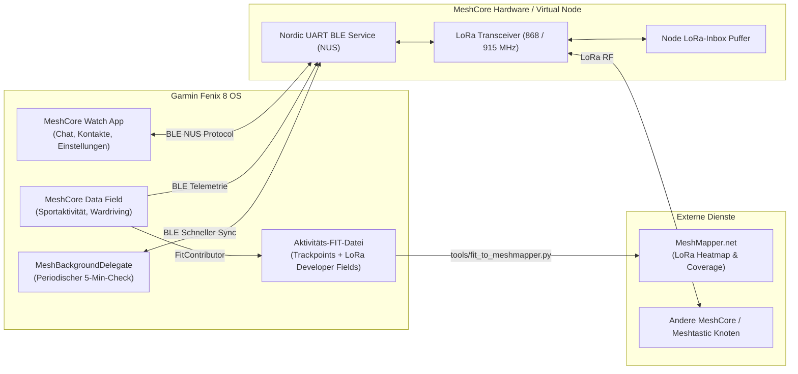
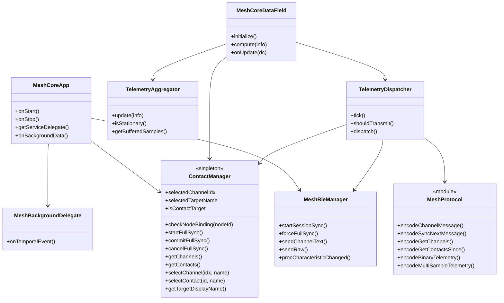
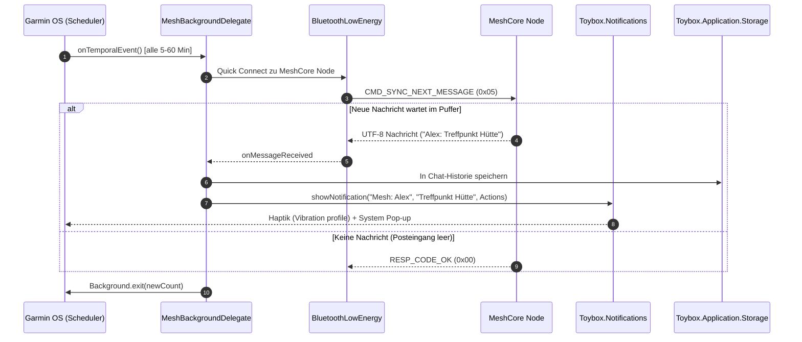
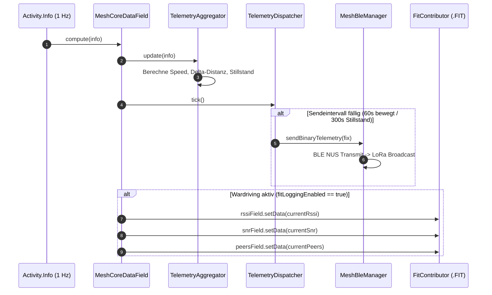
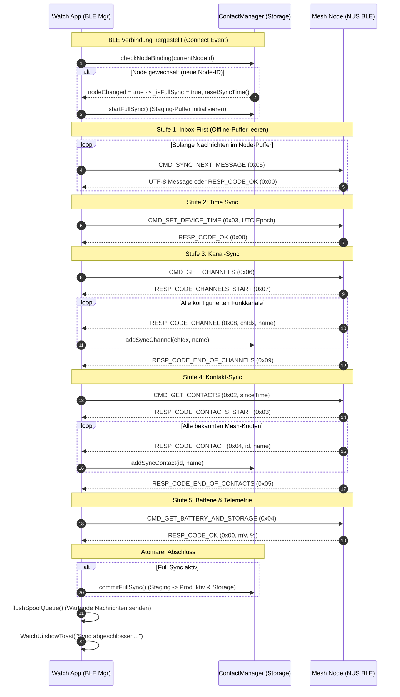

# arc42 Architektur-Dokumentation: Garmin MeshCore & MeshMapper

## 1. Einführung und Ziele

Das Projekt **Garmin MeshCore** verbindet Garmin Smartwatches (speziell Fenix 8 Serie mit Connect IQ System 8 / API Level 5.1.0) über Bluetooth Low Energy (BLE) mit autonomen LoRa-Mesh-Funkknoten (MeshCore / Meshtastic). Es ermöglicht autarke Off-Grid-Kommunikation, Notruf-Alarmierung, zyklische Telemetrie-Aussendung und LoRa-Netzabdeckungs-Kartierung (Wardriving via MeshMapper).

### 1.1 Wesentliche Qualitätsziele

| Priorität | Qualitätsziel | Motivation & Begründung |
|---|---|---|
| **1** | **Zuverlässigkeit & Ausfallsicherheit (Fail-Fast)** | Bei echten Verbindungsabbrüchen darf niemals mit scheinbar intakten Cache- oder Fake-Daten gearbeitet werden. Fehlerzustände müssen sofort gemeldet werden. |
| **2** | **Airtime- & Energie-Effizienz** | LoRa-Frequenzen unterliegen gesetzlichen Duty-Cycle-Beschränkungen (1 % in EU868). Telemetriedaten müssen ultra-kompakt übertragen und bei Stillstand gedrosselt werden. |
| **3** | **Zero-Wait UI Responsiveness** | Die Benutzeroberfläche auf der Uhr darf unter keinen Umständen durch BLE-Transfers oder Speicherzugriffe blockieren (60 FPS AMOLED Experience). |
| **4** | **Nahtlose Fitness- & MeshMapper-Integration** | LoRa-Signalstärken (RSSI, SNR) und Mesh-Metriken müssen synchron mit dem GPS-Track in die Aktivitäts-FIT-Datei geschrieben werden. |

### 1.2 Stakeholder

| Rolle | Erwartungshaltung |
|---|---|
| **Outdoor-Sportler / Wanderer** | Zuverlässige Notruffunktion, Standortübermittlung ohne Mobilfunk, Verfolgung von Teammitgliedern. |
| **Mesh-Community / Mapper** | Wardriving-Daten zur Vermessung der regionalen LoRa-Netzabdeckung (Upload zu MeshMapper.net). |
| **Entwickler & Tester** | Vollwertige Virtual-Node-Simulation direkt im Connect IQ Simulator ohne zwingende physische Funkhardware. |

---

## 2. Randbedingungen und Beschränkungen

* **Garmin Connect IQ App-Typen:** Ein Programm kann entweder `watch-app` oder `data-field` sein. Eine Kombination in einer einzigen PRG-Datei ist vom Betriebssystem nicht erlaubt $\rightarrow$ Dual-Target-Architektur (`monkey.jungle` und `datafield.jungle`).
* **Hintergrund-Ausführung (`Toybox.Background`):**
  * Mindestintervall für temporale Hintergrund-Ereignisse: **300 Sekunden (5 Minuten)**.
  * Maximale Laufzeit pro Hintergrundaufruf: **30 Sekunden**.
  * Speicherbeschränkung Hintergrundprozess: 32 KB bis 64 KB.
* **LoRa-Funkbandbreite:** Maximale Payload pro LoRa-Paket ca. 200–240 Bytes, Spreading Factor SF7 bis SF12.

---

## 3. Kontextabgrenzung



---

## 4. Lösungsstrategie

1. **Duale App-Architektur:**
   * **Target 1 (`MeshCore.prg`):** Vollwertige Watch-App für Chat, Menüs, Kontakte, Einstellungen und Hintergrundprüfungen (`Toybox.Background`).
   * **Target 2 (`MeshCoreField.prg`):** Aktivitäts-Datenfeld mit 1-Sekunden-Takt (`compute(info)`), Telemetrie-Dispatcher und `Toybox.FitContributor`.
2. **Entkoppelte Telemetrie-Pipeline:**
   * Strikte Trennung von **Messdatenerfassung** (`TelemetryAggregator`), **Sendestrategie/Filterung** (`TelemetryDispatcher`) und **Protokoll-Formatierung** (`MeshProtocol`).
   * **Smart Beaconing:** Stillstandserkennung (Speed < 0.5 m/s, Distanzdelta < 20 m) schaltet das Sendeintervall automatisch von 60s auf 300s hoch.
3. **Dual-Format-Unterstützung:**
   * **Kompakt-Binärformat (15 Bytes Single-Fix / Multi-Sample Bündelung):** Für minimale Airtime und Multi-Trackpoint-Aggregation.
   * **ASCII-Textformat:** Für direkte Lesbarkeit in öffentlichen Gruppenchats.

---

## 5. Bausteinsicht (Building Block View)



---

## 6. Laufzeitsicht (Runtime View)

### 6.1 Szenario: Background Message Check (geschlossene App)



### 6.2 Szenario: Activity Data Field Telemetrie & Wardriving



### 6.3 Szenario: 5-Stufen Session-Synchronisation & Node-Binding



---

## 7. Verteilungssicht (Deployment View)

* **`bin/MeshCompanion.prg`**: Installierbare Watch-App (Anwendungsordner auf der Uhr).
* **`bin/MeshCompanionField.prg`**: Installierbares Datenfeld für Trainings-Aktivitäten.
* **`docs/MENU_GUIDE.md`**: Umfassende Menüführungs- und Navigationsdokumentation mit Mermaid-Flowchart und Tasten-/Touch-Zuordnungen.
* **`tools/fit_to_meshmapper.py`**: Offline Python-CLI für die Konvertierung von `.fit` nach `.csv` für MeshMapper.

---

## 8. Querschnittliche Konzepte & Spezifikationen

### 8.1 Kompakt-Binärformat Spezifikation (LoRa-Airtime optimiert)

#### Single-Fix Frame (`Type = 0x01`, Gesamtlänge 15 Bytes, Little-Endian):

| Offset | Feld | Typ | Skalierung / Einheit | Wertebereich |
|---|---|---|---|---|
| `0` | `MsgType` | `uint8` | - | `0x01` (Single Fix) |
| `1 .. 4` | `Latitude` | `int32` | $\times 10^7$ (Dezimalgrad) | $-900.000.000$ bis $+900.000.000$ |
| `5 .. 8` | `Longitude` | `int32` | $\times 10^7$ (Dezimalgrad) | $-1.800.000.000$ bis $+1.800.000.000$ |
| `9 .. 10` | `Altitude` | `int16` | $1\,\text{m}$ | $-500$ bis $+9.000\,\text{m}$ |
| `11` | `HeartRate` | `uint8` | $1\,\text{bpm}$ | $0 .. 255$ (`0` = kein Sensor) |
| `12` | `Speed` | `uint8` | $0.5\,\text{km/h}$ | $0 .. 127.5\,\text{km/h}$ |
| `13` | `Battery` | `uint8` | $1\,\%$ | $0 .. 100\,\%$ |
| `14` | `Flags` | `uint8` | Bitmaske | Bit 0: Stillstand (`1`)<br>Bit 1: SOS (`1`) |

#### Multi-Sample Frame (`Type = 0x02`, Länge: $15 + N \times 6$ Bytes):
* `Byte 0`: `0x02`
* `Byte 1`: `SampleCount (N)`
* `Bytes 2 .. 14`: Basis-Fix (vollwertiger Referenzanker wie oben)
* **Je Zwischensample ($N$ Wiederholungen, 6 Bytes je Chunk):**
  * `Bytes 0 .. 1`: `DeltaTime` (`uint16`, Sekunden relativ zur Basiszeit)
  * `Bytes 2 .. 3`: `DeltaLat` (`int16`, Offset $\times 10^5$, Bereich $\pm 320\,\text{m}$)
  * `Bytes 4 .. 5`: `DeltaLon` (`int16`, Offset $\times 10^5$, Bereich $\pm 320\,\text{m}$)
  * `Byte 6`: `HeartRate` (`uint8`)

### 8.2 ASCII-Textformat Spezifikation (Chat-Kompakt)

```text
POS: <LAT>,<LON> | <ALT> | HF:<HR> | <SPEED> [STAT]
```
* **Beispiel Normalfahrt:** `POS: 47.42102,10.98544 | 1824m | HF:156bpm | 4.2km/h`
* **Beispiel Stillstand:** `POS: 47.42102,10.98544 | 1824m | HF:84bpm | 0.0km/h [STAT]`
* **Beispiel Notruf:** `[SOS] NOTRUF! Pos: 47.42102,10.98544 (1824m) HF: 168bpm`

### 8.3 FitContributor Developer Fields (Wardriving / MeshMapper)

| Field ID | Name | Typ | FIT MesgType | Einheiten | Connect IQ Chart Label |
|---|---|---|---|---|---|
| `0` | `lora_rssi` | `SINT8` | `Record` | `dBm` | LoRa RSSI |
| `1` | `lora_snr` | `SINT8` | `Record` | `dB` | LoRa SNR |
| `2` | `mesh_nodes` | `UINT8` | `Record` | `nodes` | Aktive Mesh Knoten |
| `3` | `mesh_bat` | `UINT8` | `Record` | `%` | Node Akkustand |

---

## 9. Architekturentscheidungen (ADR)

* **ADR 01: Dual Jungle Project Layout:** Trennung in `monkey.jungle` und `datafield.jungle` zur strikten Einhaltung der Connect IQ SDK Typenvorgaben unter vollständiger Wiederverwendung des Core-Codes.
* **ADR 02: 5-Minuten Temporal Event Backgrounding:** Nutzung des nativen `Toybox.Background`-APIs mit einstellbarem Intervall (5 min, 15 min, 30 min, 1h, Aus) für maximalen Akkuschutz bei zuverlässiger Benachrichtigung.
* **ADR 03: Entkopplung von Telemetrieerfassung und Übertragung:** Trennung in `TelemetryAggregator` und `TelemetryDispatcher` zur nahtlosen Unterstützung adaptiver Sendeintervalle (Smart Beaconing bei Stillstand) und Bündelung.
* **ADR 04: Fail-Fast Prinzip:** Keine gefälschten oder gecachten Signalstärken bei getrennter Verbindung. Ungültige Signalstärken werden als `null` / offline markiert.
* **ADR 05: Native Connect IQ Internationalisierung (i18n):** Trennung von englischer Basissprache (`resources/strings/strings.xml`) und deutscher Lokalisierung (`resources-deu/strings/strings.xml`) über SDK-Ressourcenqualifizierer. Zentraler statischer Helper `I18n` kapselt typensicheres Laden von `ResourceId` und Parameterersetzung (`Lang.format`).
* **ADR 06: Einheitliche AMOLED-Designsprache (UI-Harmonisierung):** Identisches visuelles Layout für Watch-App und Activity-Datenfeld: Pixel-synchrones Kartenmodul (`cardY = 136`, `cardH = 216`, `cardW = 0.81 * W`), harmonisierte Statuszeilen und Beacon-Badges, einheitliche `#`-Präfixe für Broadcast-Kanäle und Erhalt des 2-Uhr-Akzentbogens bei Ausblendung des radialen Menütexts.
* **ADR 07: Round AMOLED Safe-Zone & Emergency SOS UI:** Striktes Einhalten der geometrischen Kreisgrenzen auf runden Garmin-Displays (Fenix 8 Serie). In `SosView` werden Titel und Abbrechen/Schließen-Hinweise in die sichere Displayzone gerückt (`y = 72` und `y = height - 68`), der Countdown-Zähler wird per `TEXT_JUSTIFY_CENTER | TEXT_JUSTIFY_VCENTER` exakt im pulsierenden roten Kreis zentriert und der Notrufstatus präsentiert Vital- und GPS-Telemetrie in einer strukturierten Notfall-Karte. Nach dem Erstversand zählt ein dynamischer Auto-Repeat-Timer sekundengenau von 60s herunter (`Wiederholung in $1$s` / `Repeat in $1$s`) und sendet den LoRa-Notruf bei Erreichen von 0s zyklisch erneut mit haptischer Bestätigung.
* **ADR 08: Mesh Node Telemetry Focus (Remote Battery Monitoring):** Die Statuszeile am unteren Bildschirmrand ([Batterie-Icon] | [LoRa RSSI] | [Mesh Knoten]) visualisiert ganzheitlich den Zustand des externen MeshCore-Funkgeräts statt der Uhr. Über BLE-Sync-Stufe 4 abgefragte Akkustände (`nodeBatteryPercent`, `nodeBatteryMv`) werden live angezeigt; bei getrennter Verbindung wird gemäß Fail-Fast `--%` signalisiert.
* **ADR 09: Markenrechtliche Umbenennung in "Mesh Companion":** Zur Vermeidung von markenrechtlichen Kollisionen und unklaren Schutzrechten rund um "MeshCore" wird der sichtbare Anwendungs- und Datenfeldname offiziell in **Mesh Companion** bzw. **Mesh Companion Field** geändert. Dies betrifft `AppName`, `MenuTitle`, `NotifTitle`, `DataFieldAppName` in allen Sprachressourcen (`resources/` und `resources-deu/`) sowie die Binär-Build-Targets (`MeshCompanion.prg` und `MeshCompanionField.prg`). Die internen UUIDs und stabilen Protokollverträge bleiben unverändert.
* **ADR 10: Node-Binding, Kanal-Synchronisation & 5-Stufen-Session-Sync:** Zur Gewährleistung von Datenkonsistenz beim Wechsel von Funkknoten oder nach längerer Offline-Zeit implementiert das System ein striktes Node-Binding und eine atomare 5-Stufen-Synchronisation:
  1. *Node-Binding (`ContactManager.checkNodeBinding`)*: Die gekoppelte Node-Kennung (`cfg_paired_node_id`) wird persistent gespeichert. Erkennt das System eine veränderte Node-Kennung, wird automatisch ein Voll-Sync ausgelöst und der Sync-Zeitstempel auf 0 gesetzt.
  2. *5-Stufen Session-Sync (`MeshBleManager`)*: Bei jedem Verbindungsaufbau werden sequenziell abgefragt: 1) Inbox-Drain (`CMD_SYNC_NEXT_MESSAGE`), 2) Time-Sync (`CMD_SET_DEVICE_TIME`), 3) Funkkanäle (`CMD_GET_CHANNELS`), 4) Kontakte (`CMD_GET_CONTACTS`), 5) Batterie & Hardware-Status (`CMD_GET_BATTERY_AND_STORAGE`). Ältere Nodes ohne Kanalabfrage fallen bei `RESP_CODE_ERR` transparent auf Kontakt-Sync zurück.
  3. *Atomare Staging-Puffer (`ContactManager`)*: Eingehende Kanäle und Kontakte werden in Staging-Puffern akkumuliert und erst nach vollständigem Abschluss (`RESP_CODE_END_OF_CONTACTS`) atomar in die Produktivdaten und den persistenten Storage übernommen (`commitFullSync()`). Bei Verbindungsabbruch greift `cancelFullSync()`, sodass keine inkonsistenten Datenbestände verbleiben.
  4. *Manuelle Forcierung*: Über das Einstellungsmenü (`SettingSyncNode`) kann der Benutzer jederzeit einen vollständigen Abgleich manuell anstoßen (`forceFullSync()`).
* **ADR 11: BLE-Freigabe & Single-Central Handover ("Node freigeben (BLE)"):** Da LoRa-Mesh-Hardware wie die Seeed Studio SenseCAP T-1000E (nRF52840) als BLE Peripheral architektonisch nur genau eine aktive Central-Verbindung parallel unterstützt, würde ein ununterbrochenes Auto-Reconnect der Garmin-Uhr verhindern, dass Smartphone-Apps (Meshtastic / MeshCore) die Node koppeln können. Das System implementiert daher ein kontrolliertes Handover:
  1. *Freigabe (`MeshBleManager.releaseNode`)*: Trennt die BLE-Verbindung via `BluetoothLowEnergy.unpairDevice`, bereinigt alle Verbindungsmetriken und setzt einen Timestamp-Sperrfilter (`_pauseScanUntil = now + pauseSeconds`, Standard 180s).
  2. *Freie Bahn für das Smartphone*: Die Funk-Node sendet sofort wieder offenes BLE-Advertising und kann von der Smartphone-App gekoppelt werden, ohne dass die Uhr dazwischenfunkt.
  3. *Manuelles Reconnect*: Wählt der Benutzer auf der Uhr "Node koppeln" oder "Node neu synchronisieren", wird der Sperrfilter via `resumeScan()` sofort aufgehoben und die Verbindung priorisiert wiederhergestellt.
* **ADR 12: 3-Seiten Hauptnavigation & Tasten-Ergonomie (Zero-Clutter UI):**
  Zur Steigerung der Bedienungseffizienz und Ergonomie bei Outdoor-Aktivitäten mit Handschuhen wurde die Navigation auf ein 3-Seiten-Modell aufgeteilt:
  1. *Seite 0 (Chat & Dashboard)*: Fokus auf Kommunikation. Taste `START` (2 Uhr) öffnet direkt den aktiven Chat-Verlauf (`ChatThreadView`) in genau 1 Klick. Taste `MENU` (9 Uhr) öffnet das Hauptmenü.
  2. *Seite 1 (Telemetrie & Sensoren)*: Erreichbar über `DOWN` (7 Uhr). Taste `START` sendet sofort den aktuellen GPS-Fix und Vitaldaten via LoRa (`sendPositionDirect()`). Damit entfällt der Menüpunkt "Position senden" im Hauptmenü vollständig (2 Klicks: `DOWN` + `START`).
  3. *Seite 2 (SOS Notruf Prompt)*: Erreichbar über erneutes `DOWN` von Seite 1. Verwendet das **1:1 identische visuelle Layout wie der spätere Notruf-Modus** (Header bei $y=72$, Notfall-Telemetriekarte bei $y=120$ mit Live-GPS, Vitaldaten und Kanal 0 sowie Aktions-Prompt `START: Notruf starten` in der AMOLED-Safezone bei $y=\text{height}-68$). Taste `START` (2 Uhr) oder Touch-Tap löst direkt die 5-Sekunden-Notrufsequenz (`SosView`) aus.
  4. *Hauptmenü-Verschlankung*: Das Hauptmenü (`openMainMenu()`) wurde auf 4 Kernpunkte reduziert (Chats, SOS Notruf, Einstellungen, Beenden), wodurch die Menühöhe sinkt und versehentliche Fehlauswahlen unter Stress vermieden werden.

---

## 10. Glossar

* **Airtime:** Die Zeitdauer, für die ein Funkkanal durch eine LoRa-Aussendung physikalisch belegt wird.
* **Duty Cycle:** Gesetzliche Begrenzung der maximalen Sendezeit im Frequenzband (in der EU typischerweise 1 % pro Stunde).
* **FitContributor:** Garmin Connect IQ API zur Einbettung herstellerspezifischer Telemetriefelder in standardisierte FIT-Dateien.
* **MeshMapper:** Offene Wardriving- und Mapping-Plattform (https://meshmapper.net/) zur Visualisierung von LoRa-Mesh-Netzabdeckungen.
* **NUS (Nordic UART Service):** Standardisiertes BLE-GATT-Profil mit RX- und TX-Charakteristiken für serielle Datenströme.
* **Smart Beaconing:** Dynamische Anpassung von Sendeintervallen basierend auf Geschwindigkeit und Richtungsänderung.
