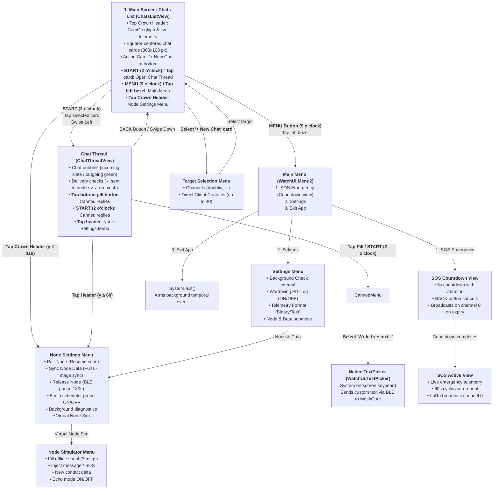

# ComOn: Menu Navigation & UI Guide

This documentation describes the complete navigation and menu hierarchy of the Garmin smartwatch app **ComOn** (including touch gestures, button mappings, pairing mechanisms, text input, and the activity data field).

> [!NOTE]
> **Status:** This document reflects the current architecture: 2-screen messenger layout (`ChatsListView` and `ChatThreadView`), native Garmin `WatchUi.TextPicker` for free-text input, and background BLE auto-discovery / session sync.

---

## 1. Visual Navigation Flowchart (Mermaid)



---

## 2. Detailed Screen & Navigation Reference

### 2.1 Screen 1: Chats List (`ChatsListView` & `ChatsListDelegate`)

The primary home screen is a scrollable list of conversations modeled after the WhatsApp watch interface:

#### Top Crown Header (Option A)
* **Visuals:** Centered green ComOn speech-bubble glyph and app title at `y = 46`, with live node telemetry at `y = 82`:
  * **When Connected:** Vector battery gauge with percentage (e.g. `85%`), separator bullet (`•`), 4-bar LoRa signal meter, and RSSI (e.g. `-82dBm`).
  * **When Syncing:** Cyan `Syncing with Node...`.
  * **When Scanning:** Cyan `Searching Node...`.
  * **When Disconnected:** Orange `Disconnected`.
* **Touch Action:** Tapping the Crown Header area (`y <= scale(110)`) directly opens `NodeSettingsMenu`.

#### Chat Cards & List Behavior
* **Dimensions:** 368 x 108 px cards with 18 px corner radius, centered at the display equator (`y = 215`).
* **Active / Selected Card:** Highlighted with a bright focus outline.
* **Card Details:** Channel name (e.g. `#public`) or contact name, last message preview, relative time ago (e.g. `2m`, `now`), and unread count badge.
* **Bottom Action Card:** A special `+ New Chat` action card sits at the bottom of the list. Selecting it opens `TargetSelectMenu` to start a conversation with any synced client contact.

#### Button & Gesture Controls
* **START Button (2 o'clock) / Tap on Card / Swipe Left:** Opens the selected conversation in `ChatThreadView`.
* **MENU Button (9 o'clock) / Tap Left Bezel Edge:** Opens the `MainMenu`.
* **UP / DOWN Buttons (9 & 7 o'clock) / Vertical Swipe:** Scrolls through the conversation list.
* **BACK Button (4 o'clock):** Exits the application.

---

### 2.2 Screen 2: Chat History (`ChatThreadView` & `ChatThreadDelegate`)

Dedicated conversation thread for the selected channel or 1:1 contact:

#### Visual Layout & Status Indicators
* **Header:** Contact / channel name centered at `y = 38`. Tapping the header (`y <= 60`) opens `NodeSettingsMenu`.
* **Message Bubbles:**
  * **Incoming:** Dark slate rounded boxes aligned to the left, showing sender name in orange and received text.
  * **Outgoing:** Dark green rounded boxes aligned to the right, showing sender `"You"` / `"Ich"` in accent green.
* **Delivery Status Checkmarks (Vector rendered):**
  * `STATUS_QUEUED` (0): Clock icon indicating the message is spooled or awaiting BLE acknowledgement.
  * `STATUS_SENT_NODE` (1): Single green checkmark (`✓`) confirming the local MeshCore node received the packet via BLE.
  * `STATUS_CONFIRMED_MESH` (2): Double green checkmark (`✓✓`) confirming the node transmitted the LoRa packet into the mesh (via `PushSendConfirmed` 0x82).

#### Action Controls
* **Bottom Pill Button (`[ Message ]` / `[ Nachricht ]`)**: WhatsApp-style rounded green capsule button at the bottom of the screen (`y = 378`). Tapping it opens `CannedMessageMenu`.
* **START Button (2 o'clock):** Opens `CannedMessageMenu`.
* **UP / DOWN Buttons / Drag:** Scrolls message history.
* **BACK Button (4 o'clock) / Swipe Down:** Returns to `ChatsListView`.

---

## 3. Text Input & Messaging

In ComOn, text entry is implemented natively through the Connect IQ system rather than custom software keyboard widgets:

### 3.1 Text Input Architecture
* **Native System Keyboard (`WatchUi.TextPicker`):** 
  * Accessed via `CannedMessageMenu` $\rightarrow$ **"Write free text..."** (`MSG_CUSTOM`).
  * Managed by `KeyboardHelper.openKeyboardForTarget(initialText, targetId)`.
  * Invokes Garmin's built-in platform `WatchUi.TextPicker`. Depending on the Garmin device hardware and system firmware, this presents the watch's native text entry method (on-screen keyboard, T9, or Garmin Connect Mobile phone input) with full multilingual and dictionary support.
  * When input is confirmed, `CustomTextPickerDelegate` dispatches the message via `MeshBleManager` (`sendTextToConversation` for contacts or `sendChannelText` for channels).

### 3.2 Quick Replies (`CannedMessageMenu`)
Opened by pressing **START** in `ChatThreadView`, tapping the bottom **`[ Message ]`** pill button, or selecting **"Send message"** from the main menu:

| Item | Subtitle | Action |
|---|---|---|
| **Write free text...** | `Keyboard` | Opens Garmin native `WatchUi.TextPicker` for custom text input. |
| **Send position** | `GPS + Vitals` | Sends current GPS coordinates and sensor vitals as a message. |
| **All OK** | `Status` | Sends canned "All OK" reply. |
| **At meeting point** | `Status` | Sends canned "At meeting point" reply. |
| **Delay 15 min** | `Time` | Sends canned "Delay 15 min" reply. |
| **Delay 30 min** | `Time` | Sends canned "Delay 30 min" reply. |
| **Need help** | `Urgent` | Sends canned "Need help" reply. |
| **Radio check** | `Test` | Sends canned "Radio check" reply. |

---

## 4. BLE Connection & Node Pairing Mechanism

Pairing and connection handling in ComOn are designed around autonomous BLE discovery, graceful reconnects, and single-central handover:

### 4.1 How Pairing Works in ComOn
1. **Nordic UART Service (NUS) Discovery:**
   * ComOn registers the Nordic UART Service UUID (`6e400001-b5a3-f393-e0a9-e50e24dcca9e`).
   * When scanning is active, advertisements matching this service UUID are matched automatically.
2. **Auto-Pairing (`connectLatestOrScan`):**
   * On startup, ComOn checks `BluetoothLowEnergy.getPairedDevices()`. If an already-paired device is connected at the OS level, it adopts it immediately.
   * If not connected, `startScan()` starts BLE scanning (with a 15-second timeout and retry timer).
   * When an advertising MeshCore device is discovered, `BluetoothLowEnergy.pairDevice(res)` is invoked directly to bond and pair.
3. **Session Synchronization (6-Stage Pipeline):**
   * Once GATT connection and CCCD descriptor writes succeed, ComOn executes a sequential 6-stage protocol sync:
     * **Stage 1 (Battery & Storage):** Queries battery voltage and percentage (`CMD_GET_BATTERY_AND_STORAGE`).
     * **Stage 2 (Device Time):** Synchronizes watch clock with node RTC (`CMD_SET_DEVICE_TIME`).
     * **Stage 3 (Radio Stats):** Reads RSSI and SNR (`CMD_GET_STATS - STATS_TYPE_RADIO`).
     * **Stage 4 (Channels):** Reads channel configuration slots 0 to 7 (`CMD_GET_CHANNEL`).
     * **Stage 5 (Contacts):** Streams known mesh contact nodes (`CMD_GET_CONTACTS`).
     * **Stage 6 (Inbox Drain):** Drains buffered offline messages (`CMD_SYNC_NEXT_MESSAGE`).
4. **Periodic 60s Telemetry Polling:**
   * In foreground operation, a 60-second timer periodically queries battery and radio statistics to keep the Crown Header status up to date.

### 4.2 Handover & Re-Pairing Controls
Available in `NodeSettingsMenu` (accessible by tapping the Crown Header or via Main Menu $\rightarrow$ Settings $\rightarrow$ Node & Data):

* **Pair Node (`SET_PAIR`):** Clears scan pauses (`resumeScan()`), resumes discovery, and scans for nearby MeshCore nodes.
* **Sync Node Data (`SET_SYNC`):** Forces an immediate full 6-stage session sync (`forceFullSync()`) from the connected node.
* **Release Node (BLE) (`SET_RELEASE`):** Calls `unpairDevice()`, cleans connection metrics, and pauses BLE scanning for **180 seconds** (3 minutes). This frees the BLE peripheral connection so a smartphone app (such as the Seeed SenseCAP or Meshtastic app on iOS/Android) can connect to the T-1000E or MeshCore node without interference from the watch.
* **Virtual Node Sim (`SET_SIM`):** Opens the simulation test bench to inject test messages, SOS alerts, or contacts without hardware.

---

## 5. Main Menu (`MainMenuDelegate`)

Opened by pressing **MENU (9 o'clock)** on the Chats screen or tapping the left bezel edge:

| Menu Item | Subtitle | Action |
|---|---|---|
| **SOS Emergency** | `Emergency broadcast` | Opens `SosCountdownView` (5s countdown followed by emergency broadcast). |
| **Settings** | `Node, FIT Log, Telemetry...` | Opens `SettingsMenu`. |
| **Exit App** | - | Exits the application and arms the background check. |

---

## 6. Settings Menu Hierarchy

### 6.1 General Settings (`SettingsMenu`)
* **Background Check:** Sets the temporal event interval (`Toybox.Background`): `5 min (Default)`, `15 min`, `30 min`, `1 hour`, or `Off / Disabled`. Checks incoming packets while the app is closed.
* **Wardriving FIT-Log:** Toggle `Active (ON)` / `Inactive (OFF)`. Logs LoRa RSSI, SNR, and node count to FIT activity files for MeshMapper.net.
* **Telemetry Format:** Toggle between `Compact Binary` (15-byte compact payload) and `Chat Text` (human-readable text).
* **Node & Data:** Submenu navigation to `NodeSettingsMenu`.

### 6.2 Node & Data Submenu (`NodeSettingsMenu`)
* **Pair Node:** Resumes scanning for BLE nodes.
* **Sync Node Data:** Triggers full 6-stage sync.
* **Release Node (BLE):** Unpairs and pauses BLE connection for 180 seconds.
* **5 min scheduler probe:** Toggles background scheduling diagnostic probe.
* **Background Run Diagnostics:** Displays outcome of the last background execution (`messages`, `no run`, or error).
* **Virtual Node Sim:** Opens simulator menu for development testing.

---

## 7. Emergency SOS System (`SosCountdownView` & `SosActiveView`)

Designed to prevent false alarms while providing reliable emergency transmission:

```text
[ Trigger SOS ] (via Main Menu -> SOS Emergency)
      │
      ▼
Phase 1: 5-Second Countdown (SosCountdownView)
  • Centered countdown counter (5..4..3..2..1)
  • Distinct haptic vibration pulses every second
  • BACK Button: Immediately aborts (zero RF transmission)
      │
      ▼ (on countdown expiry)
Phase 2: Emergency Active (SosActiveView)
  • Sends emergency broadcast on channel 0 via MeshCore
  • Double haptic vibration confirmation
  • Displays live emergency telemetry card (GPS coordinates, elevation, vitals)
  • 60-second auto-repeat timer counts down and re-transmits emergency beacon
  • BACK Button: Closes the view
```

---

## 8. Activity Data Field (`MeshCompanionField` / `ComOnDatafield`)

Integrates into Garmin sport activity profiles (hiking, trail running, cycling):
* **Independent App ID:** The data field operates under a separate Connect IQ Application ID with its own background BLE manager and storage configuration.
* **Display:** Compact card module showing node battery percentage, signal bars, and beacon status.
* **Smart Beaconing:** Broadcasts telemetry every 60s when moving and every 300s when stationary.
* **In-Activity Settings Menu:** Accessed by holding the MENU button while on the data field screen to switch destination channels or contacts.
